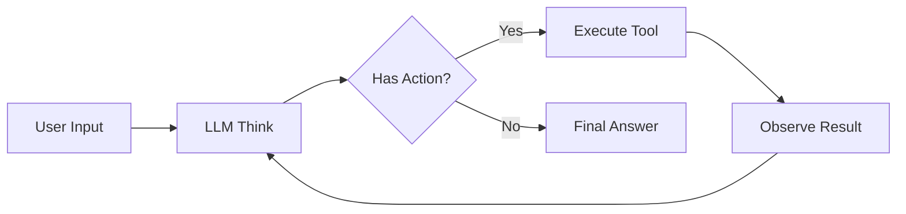
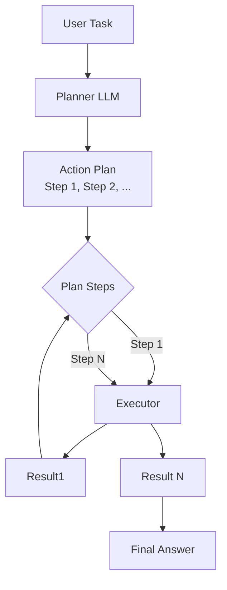
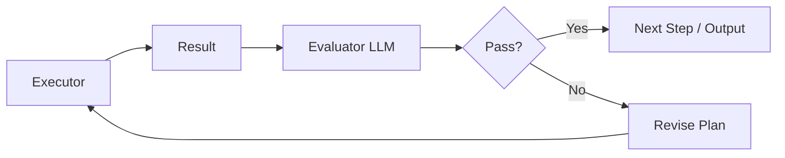
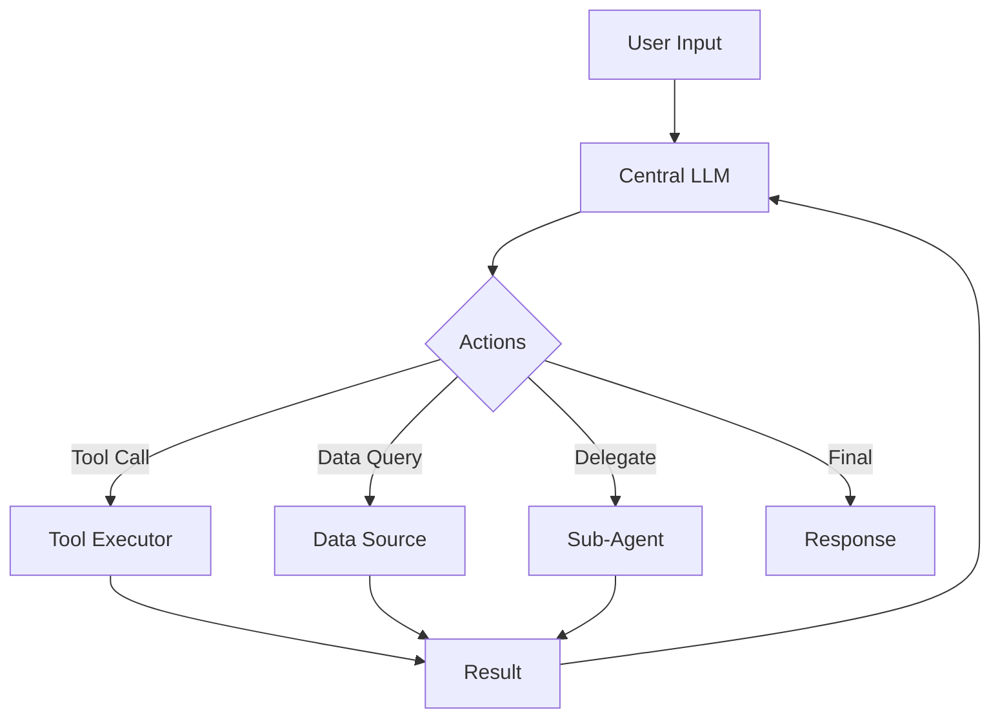
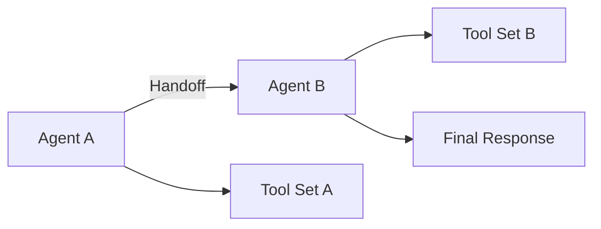
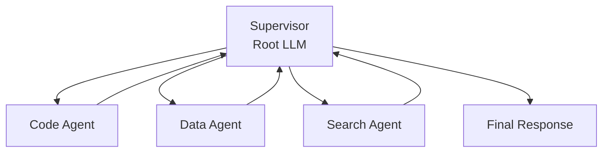

# Agent 设计模式全解：从 ReAct 到 Supervisor

> 本文系统化梳理当前主流 Agent 架构模式，每种模式从概念、流程、伪代码、框架实现四个维度展开，可作为"模式词典"长期参考。

<!-- more -->

## 概述

Agent（智能体）系统的核心问题是如何让大模型自主完成复杂任务。当前主流框架（LangGraph、CrewAI、AutoGen、OpenAI Agents SDK）的设计思想都可以归纳为若干**架构模式**。理解这些模式，就能在设计 Agent 系统时做出更好的技术选型和架构决策。

本文覆盖 6 种核心模式：

| 层级 | 模式 | 核心问题 |
|------|------|---------|
| 感知层 | **ReAct** | 如何让 Agent 在推理中调用工具？ |
| 规划层 | **Plan-Execute** | 如何将复杂任务拆解为子任务？ |
| 评审层 | **EE（Evaluation-Agent）** | 如何在执行后自动校验结果质量？ |
| 协作层 | **MCP（Model-Centralized-Protocol）** | 如何标准化工具/资源调用？ |
| 协作层 | **Handoff** | 如何在智能体之间传递控制权？ |
| 编排层 | **Supervisor** | 如何用树结构编排多智能体？ |

---

## 一、ReAct 模式

### 1.1 概念

**ReAct = Reasoning + Acting**。核心思想是将大模型的"推理"和"行动"交替进行：模型先思考当前状态和目标，决定下一步动作，执行后观察结果，再进入下一轮思考。

传统的大模型调用是"一次性"的——给一个 prompt，返回一个答案。ReAct 引入了一个**循环**，让模型可以在执行过程中不断更新自己的认知。



### 1.2 伪代码

```python
def react_loop(user_input, tools, max_iterations=10):
    history = []
    observation = None

    for _ in range(max_iterations):
        # 1. Think — 根据当前状态生成下一步动作
        prompt = build_react_prompt(user_input, history, observation, tools)
        response = llm.generate(prompt)

        # 2. Parse — 从响应中提取动作
        action = parse_action(response)  # {tool: "search", args: {...}}

        if action is None:
            # 无可用动作，说明推理完成
            break

        # 3. Act — 执行工具
        result = execute_tool(action["tool"], action["args"])
        observation = result

        # 4. Observe — 将结果加入历史
        history.append({"role": "assistant", "content": response})
        history.append({"role": "user", "content": f"Observation: {result}"})

    return extract_final_answer(history)
```

### 1.3 框架对照

| 框架 | 实现方式 |
|------|---------|
| **LangGraph** | `ReActAgent` 预构建节点，基于 `StateGraph` 实现循环推理 |
| **OpenAI Agents SDK** | `Agent` 类默认使用 ReAct 风格的 `handoff` 和 `tool_calls` |
| **CrewAI** | `ReasearchAgent` 等内置 Agent 默认使用 ReAct 模式 |
| **AutoGen** | 通过 `UserProxyAgent` + `FunctionAgent` 实现 ReAct 循环 |

---

## 二、Plan-Execute 模式

### 2.1 概念

**Plan-Execute = Planning + Execution**。核心思想是将任务处理分为两个阶段：

1. **Planning阶段**：模型先完整分析任务，输出一个**行动计划**（step-by-step plan）
2. **Execution 阶段**：按计划逐条执行，每条可独立运行

Plan-Execute 的优势在于**计划可审计、可干预**。用户或评审层可以在执行过程中修改计划。



### 2.2 伪代码

```python
def plan_execute(task, executor_fn, max_retries=3):
    # Phase 1: Planning
    plan_prompt = f"""Task: {task}
    Break down into concrete steps. Output a JSON array of steps."""
    plan = llm.generate_json(plan_prompt)  # [{"step": 1, "action": "...", "description": "..."}]

    results = []
    for step in plan:
        # Phase 2: Execution (with retry)
        for attempt in range(max_retries):
            try:
                result = executor_fn(step)
                results.append({"step": step, "result": result, "status": "success"})
                break
            except Exception as e:
                if attempt == max_retries - 1:
                    results.append({"step": step, "result": str(e), "status": "failed"})
                # Retry or revise plan
                continue

    # Phase 3: Synthesize
    final_prompt = f"Task: {task}\nResults: {results}\nSynthesize the final answer."
    return llm.generate(final_prompt)
```

### 2.3 框架对照

| 框架 | 实现方式 |
|------|---------|
| **LangGraph** | 通过 `ToolNode` + `StateGraph` 分离 Planning 和 Execution 节点 |
| **OpenAI Agents SDK** | `Agent` 的 `instructions` 中可内置 planning prompt，引导模型先生成计划 |
| **CrewAI** | `Task` 声明 `async_execution=True` 时按顺序执行；`Process.sequential` 体现 Plan-Execute |
| **AutoGen** | `GroupChat` 支持 `speaker_selection_method="round_robin"` 可实现顺序执行模式 |

---

## 三、EE（Evaluation-Agent）模式

### 3.1 概念

**EE = Execution + Evaluation**。核心思想是引入一个独立的**评审 Agent**（Evaluator），对执行结果进行自动校验：

- 如果结果合格 → 进入下一步或输出
- 如果结果不合格 → **触发重试或修改计划**

这解决了"模型不知道自己答错了"的问题，尤其在代码生成、数据处理等需要精确结果的场景中效果显著。



### 3.2 伪代码

```python
def ee_loop(task, executor_fn, evaluator_fn, max_iterations=5):
    plan = generate_plan(task)
    context = {}

    for iteration in range(max_iterations):
        # Execute
        result = executor_fn(plan, context)

        # Evaluate
        eval_result = evaluator_fn(task, result)

        if eval_result["passed"]:
            return eval_result["answer"]

        # Not passed: get revision feedback
        feedback = eval_result["feedback"]
        plan = revise_plan(plan, feedback)
        context["last_feedback"] = feedback

    raise MaxIterationsExceeded(f"Failed after {max_iterations} iterations")
```

### 3.3 框架对照

| 框架 | 实现方式 |
|------|---------|
| **LangGraph** | 通过条件边（conditional edge）实现 `should_continue` 判断，Evaluator 本质是一个 `ToolNode` |
| **OpenAI Agents SDK** | 内置 `handoff` 机制支持在 Agent 之间传递评审结果 |
| **CrewAI** | `Process.hierarchical` 模式下 Manager Agent 可充当 Evaluator 角色 |
| **AutoGen** | 可通过 `TwoAgentsChat`（UserProxy + Assistant）实现简单的 EE 循环 |

---

## 四、MCP（Model-Centralized-Protocol）模式

### 4.1 概念

**MCP = Model-Centralized Protocol**。虽然名字听起来像协议，但这里的"MCP"指的是一种以**模型为中心调度一切资源**的设计哲学：

- 所有的工具调用、资源获取、信息查询都**必须经过大模型决策**
- 模型是整个系统的唯一入口和调度中枢
- 工具是模型的"手脚"，而模型是整个系统的"大脑"

与直接硬编码工作流不同，MCP 模式下系统的下一步动作完全由模型决定，具有极高的灵活性。



### 4.2 伪代码

```python
def mcp_loop(user_input, tools_registry, max_turns=20):
    session = [{"role": "user", "content": user_input}]

    while len(session) //2 < max_turns:
        # 唯一的调度入口：中央模型
        response = llm.chat(session, tools=tools_registry.list_tools())

        if response.tool_calls:
            # 有工具调用，执行并追加结果
            for call in response.tool_calls:
                result = tools_registry.execute(call.name, call.arguments)
                session.append({"role": "tool", "tool_call_id": call.id, "content": result})
        else:
            # 无工具调用，直接返回
            return response.content

    return "Max turns exceeded"
```

### 4.3 框架对照

| 框架 | 实现方式 |
|------|---------|
| **LangGraph** | 所有节点都通过边（edge）连接到中央 LLM 节点，工具作为 `ToolNode` 被模型调用 |
| **OpenAI Agents SDK** | 架构天然是 MCP：`Agent` 是唯一入口，`tools` 作为可调用资源注入 |
| **CrewAI** | 每个 Agent 都有独立工具集，但最终由 `Crew` 的 `Process` 决定调度权归属 |
| **AutoGen** | `AssistantAgent` 是 MCP 的典型实现，所有工具调用必须经过 `AssistantAgent` |

---

## 五、Handoff 模式

### 5.1 概念

**Handoff = Transfer of Control**。核心思想是当一个 Agent 处理不了当前任务时，将控制权**完整地移交给另一个 Agent**，后者拥有自己的工具集、指令和上下文。

Handoff 是多智能体协作的基石，常见场景：

- 客服场景：分类 Agent → 售后 Agent / 售前 Agent
- 编程场景：代码 Agent → 调试 Agent → 重构 Agent
- 研究场景：搜索 Agent → 分析 Agent → 写作 Agent



### 5.2 伪代码

```python
def handoff_loop(start_agent, user_input):
    current_agent = start_agent
    session = [{"role": "user", "content": user_input}]

    while True:
        response = current_agent.chat(session)

        if response.handoff:
            #交接给下一个 Agent
            next_agent_name = response.handoff["target"]
            next_agent = agent_registry.get(next_agent_name)

            # 携带上下文交接
            session.append({"role": "assistant", "content": response.content})
            session.append({
                "role": "system",
                "content": f"Handoff to {next_agent_name}. Context: {response.handoff.get('context')}"
            })

            current_agent = next_agent
        else:
            return response.content
```

### 5.3 框架对照

| 框架 | 实现方式 |
|------|---------|
| **LangGraph** | 通过 `ManualHandoffNode` 或在边定义中显式 `handoff` 函数实现节点间传递 |
| **OpenAI Agents SDK** | `handoff` 方法显式定义交接目标，携带 `context` 传递历史 |
| **CrewAI** | 任务交接通过 `Task.handoff_on=True` 配置，到达条件后自动流转到下一个 Agent |
| **AutoGen** | 通过 `GroupChat` 的 `speaker_selection` 回调函数实现灵活的交接逻辑 |

---

## 六、Supervisor 模式

### 6.1 概念

**Supervisor = Tree-Structured Orchestration**。核心思想是用一个**监督者（Supervisor）**作为根节点，以树形结构组织多个子 Agent，每个子 Agent 负责特定领域的任务。

Supervisor 不直接执行任务，而是：
1. 分解任务给子 Agent
2. 收集子 Agent 的结果
3. 整合后返回给用户

这非常适合复杂的企业级应用——比如同时调用代码生成、数据分析、文档检索等多个能力。



### 6.2 伪代码

```python
def supervisor_loop(task, agents, max_depth=3):
    #agents: {"code": code_agent, "data": data_agent, "search": search_agent}

    def solve(subtask, depth):
        if depth > max_depth:
            return {"status": "max_depth", "content": None}

        # Supervisor 做决策：分解任务
        plan = llm.generate_json(
            f"Task: {subtask}\nAvailable agents: {list(agents.keys())}\n"
            "Return JSON: {\"assignments\": [{\"agent\": \"...\", \"subtask\": \"...\"}]}"
        )

        results = {}
        for assignment in plan["assignments"]:
            agent = agents[assignment["agent"]]
            sub_result = agent.chat(assignment["subtask"])
            results[assignment["agent"]] = sub_result.content

        # Supervisor整合结果
        final = llm.generate(
            f"Original task: {subtask}\nSub-results: {results}\nSynthesize answer."
        )

        return {"status": "success", "content": final}

    return solve(task, depth=0)
```

### 6.3 框架对照

| 框架 | 实现方式 |
|------|---------|
| **LangGraph** | `RootMarshalAgent` 模式，多个 `ChildAgent` 作为子节点，Supervisor 通过条件边分发任务 |
| **OpenAI Agents SDK** | 通过 `SupervisorAgent` 管理子 Agent，使用 `handoff` 收集子 Agent 结果 |
| **CrewAI** | `Process.hierarchical` 下，Manager Agent 就是 Supervisor，负责分解和分配任务 |
| **AutoGen** | `NestedChat` 支持嵌套聊天，一个顶层 Agent 充当 Supervisor 管理子对话 |

---

## 七、模式之间的组合关系

以上六种模式并非孤立，而是可以**叠加组合**形成完整的 Agent 系统。典型的组合方式：

```
ReAct + Plan-Execute
└── 每个计划步骤内部用 ReAct 循环

Plan-Execute + EE
└── 执行阶段加入评审 Agent，形成 EE 循环

MCP + Handoff
└── 中央 LLM 根据上下文决定 Handoff 目标

Supervisor + EE + Plan-Execute
└── Supervisor 分解任务 → 子 Agent 按 Plan-Execute 执行 → Evaluator 评审

CrewAI 的 hierarchical 模式本质上就是 Supervisor + Handoff
LangGraph 的 StateGraph 可以表达所有以上模式
```

---

## 八、总结

| 模式 | 解决的问题 | 适用场景 |
|------|-----------|---------|
| **ReAct** | 推理与行动分离 | 需要调用工具的单一 Agent 任务 |
| **Plan-Execute** | 复杂任务拆解 | 多步骤、需要计划可审计的任务 |
| **EE** | 结果自动校验 | 代码生成、数据处理等高精度场景 |
| **MCP** | 集中式调度 | 工具众多、需要灵活编排的系统 |
| **Handoff** | 智能体间协作 | 需要角色分工的对话/任务系统 |
| **Supervisor** | 树形编排 | 复杂企业应用、多能力协同系统 |

理解这六种模式，就能看清 LangGraph、CrewAI、AutoGen、OpenAI Agents SDK 这些框架背后的设计哲学：它们都在以不同方式组合这些模式，trade-off 不同，适合的场景也不同。

---

**下一篇预告**：Agent 设计模式框架对比——各模式在 LangGraph、CrewAI、AutoGen、OpenAI Agents SDK 中的实现细节与性能差异。

---

## 参考资料

- [LangGraph 官方文档](https://langchain.com/langgraph)
- [OpenAI Agents SDK 文档](https://platform.openai.com/docs/agents)
- [CrewAI 官方文档](https://docs.crewai.com)
- [AutoGen GitHub](https://github.com/microsoft/autogen)
- [ReAct: Synergizing Reasoning and Acting in Language Models](https://arxiv.org/abs/2210.03629)