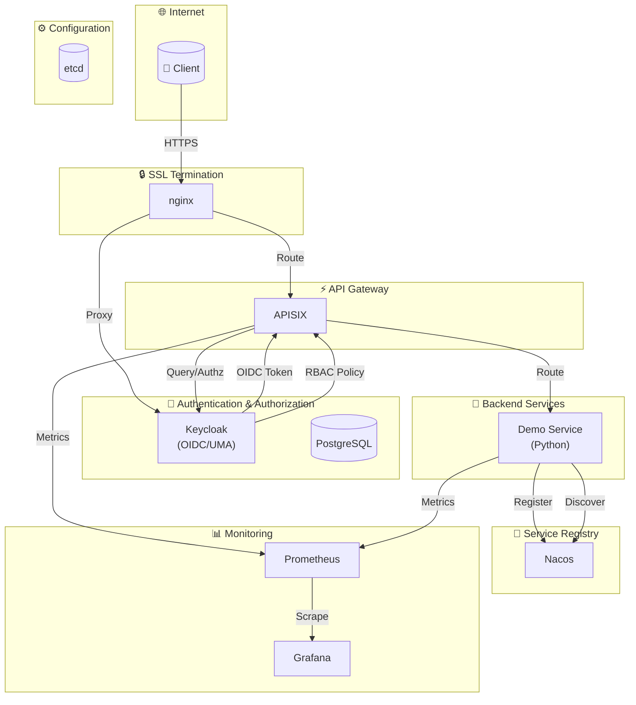

## TL;DR

```bash
# 拉取代码
git clone https://github.com/liukunup/personal-ai-infrastructure.git

# 拉起服务
docker compose up -d
```

## 架构图



## 自动初始化 (kcadm + APISIX Admin API)

启动时自动配置，无需手动操作：

1. **Keycloak 配置** (via keycloak-init.sh)
   - Realm: `pai_realm`
   - Client: `pai-client` (confidential, OIDC client_secret_post)
   - Roles: `admin`, `user`, `guest`
   - Users: `testuser/testPass@123!` (user role), `admin/changeit` (admin role)

2. **APISIX 配置** (via apisix-init.sh)
   - Consumer: `hmac-consumer` with HMAC credentials
   - Routes:
     - `demo-api-route` (`/demo/api/*` → `/api/v1/*`)
     - `demo-openapi-route` (`/demo/openapi/*` → `/api/v1/*`, hmac-auth + limit-req)
     - `demo-users-route` (`/demo/users/*` → `/api/v1/*`, OIDC + Casbin)
     - `demo-admin-route` (`/demo/admin/*` → `/api/v1/*`, OIDC + Casbin admin-only)

## API Routes

| Route | Auth | Upstream |
|-------|------|----------|
| `/demo/api/*` | None (proxy-rewrite only) | `/api/v1/*` |
| `/demo/openapi/*` | hmac-auth + limit-req | `/api/v1/*` |
| `/demo/users/*` | openid-connect + authz-casbin | `/api/v1/*` |
| `/demo/admin/*` | openid-connect + authz-casbin (admin only) | `/api/v1/*` |
| `/demo/keycloak/*` | authz-keycloak (UMA, lazy_load_paths, http_method_as_scope) | `/api/v1/*` |

## Demo Service Endpoints

- `GET /` - Health check
- `GET /health` - Health check
- `GET /api/v1/echo?msg=xxx` - Echo endpoint

## .env.example

```plaintext
# Keycloak
KC_ADMIN_USERNAME=admin
KC_ADMIN_PASSWORD=changeit
KC_HOSTNAME=https://keycloak.example.com

# Keycloak Realm
KC_REALM=pai_realm

# Keycloak Client
CLIENT_ID=pai-client
CLIENT_NAME=Personal AI Infrastructure

# Keycloak Test User
TEST_USERNAME=
TEST_PASSWORD=
TEST_FIRSTNAME=
TEST_LASTNAME=

# PostgreSQL
PG_USERNAME=keycloak
PG_PASSWORD=changeit
PG_HOST=postgres
PG_PORT=5432

# Nacos
NACOS_AUTH_TOKEN=VGhpc0lzTXlDdXN0b21TZWNyZXRLZXkwMTIzNDU2Nzg=

# APISIX Test
APISIX_TEST_BASE_URL=https://api.example.com
APISIX_HMAC_KEY_ID=
APISIX_HMAC_SECRET_KEY=
APISIX_ADMIN_URL=http://apisix:9180
APISIX_ADMIN_KEY=
```

## docker-compose.yaml

```yaml
name: pai

networks:
  pai:
    driver: bridge

volumes:
  postgres:
  etcd:
  prometheus:

services:

  nginx:
    image: nginx
    container_name: nginx
    restart: always
    volumes:
      # Nginx 配置文件
      - ./nginx_conf/nginx.conf:/etc/nginx/nginx.conf:ro
      - ./nginx_conf/nginxconfig.io:/etc/nginx/nginxconfig.io:ro
      - ./nginx_conf/sites-available:/etc/nginx/sites-available:ro
      - ./nginx_conf/sites-enabled:/etc/nginx/conf.d:ro
      # DH 参数文件
      - ./nginx_conf/ssl/dhparam.pem:/etc/nginx/dhparam.pem:ro
      # CA 证书
      - ./nginx_conf/ssl/ca.crt:/etc/nginx/ssl/ca.crt:ro
      # APISIX 证书
      - ./nginx_conf/ssl/api.example.com/server.crt:/etc/nginx/ssl/api.example.com.crt:ro
      - ./nginx_conf/ssl/api.example.com/server.key:/etc/nginx/ssl/api.example.com.key:ro
      # Keycloak 证书
      - ./nginx_conf/ssl/keycloak.example.com/server.crt:/etc/nginx/ssl/keycloak.example.com.crt:ro
      - ./nginx_conf/ssl/keycloak.example.com/server.key:/etc/nginx/ssl/keycloak.example.com.key:ro
    ports:
      - 80:80    # HTTP
      - 443:443  # HTTPS
    networks:
      pai:

  keycloak:
    image: keycloak/keycloak:26.6.2
    container_name: keycloak
    restart: always
    command:
      - start
      - --http-enabled=true                  # 启用 HTTP
      - --proxy-headers=xforwarded           # 解析 X-Forwarded-* 头
      - --hostname=${KC_HOSTNAME}            # 设置公共域名
      - --hostname-backchannel-dynamic=true  # 启用动态后端主机名解析
      - --hostname-strict=false              # 允许不匹配主机名的请求
      - --health-enabled=true                # 启用健康检查端点
      - --metrics-enabled=true               # 启用服务指标端点
    environment:
      # 管理员配置
      KC_BOOTSTRAP_ADMIN_USERNAME: ${KC_ADMIN_USERNAME:-admin}
      KC_BOOTSTRAP_ADMIN_PASSWORD: ${KC_ADMIN_PASSWORD:?KC_ADMIN_PASSWORD is not set}
      # 数据库配置
      KC_DB: postgres
      KC_DB_USERNAME: ${PG_USERNAME:-keycloak}
      KC_DB_PASSWORD: ${PG_PASSWORD:?PG_PASSWORD is not set}
      KC_DB_URL_HOST: ${PG_HOST:-postgres}
      KC_DB_URL_PORT: ${PG_PORT:-5432}
      KC_DB_URL_DATABASE: keycloak
    depends_on:
      postgres:
        condition: service_healthy
    networks:
      pai:
    healthcheck:
      test: |
        CMD-SHELL
        { printf 'HEAD /health/ready HTTP/1.0\r\n\r\n' >&0; grep 'HTTP/1.0 200'; } 0<>/dev/tcp/localhost/9000
      interval: 10s
      timeout: 5s
      retries: 3
      start_period: 60s

  postgres:
    image: postgres
    container_name: postgres
    restart: always
    environment:
      POSTGRES_DB: keycloak
      POSTGRES_USER: ${PG_USERNAME:-keycloak}
      POSTGRES_PASSWORD: ${PG_PASSWORD:?PG_PASSWORD is not set}
    volumes:
      - postgres:/var/lib/postgresql
    networks:
      pai:
    healthcheck:
      test: |
        CMD-SHELL
        pg_isready -h 127.0.0.1 -p 5432 -d keycloak -q -U ${PG_USERNAME:-keycloak}
      interval: 10s
      timeout: 5s
      retries: 3
      start_period: 30s

  keycloak-init:
    image: keycloak/keycloak:26.6.2
    container_name: keycloak-init
    restart: "no"
    entrypoint: ["/bin/bash", "/scripts/keycloak-init.sh"]
    volumes:
      - ./scripts/keycloak-init.sh:/scripts/keycloak-init.sh:ro
    environment:
      KC_ADMIN_USERNAME: ${KC_ADMIN_USERNAME:-admin}
      KC_ADMIN_PASSWORD: ${KC_ADMIN_PASSWORD:?KC_ADMIN_PASSWORD is not set}
      KC_REALM: ${KC_REALM:?KC_REALM is not set}
      CLIENT_ID: ${CLIENT_ID:-pai-client}
      CLIENT_NAME: ${CLIENT_NAME:-PAI Client}
      TEST_USERNAME: ${TEST_USERNAME:-testuser}
      TEST_PASSWORD: ${TEST_PASSWORD:?TEST_PASSWORD is not set}
      TEST_FIRSTNAME: ${TEST_FIRSTNAME:-Test}
      TEST_LASTNAME: ${TEST_LASTNAME:-User}
    depends_on:
      keycloak:
        condition: service_healthy
    networks:
      pai:

  apisix:
    image: apache/apisix:3.14.1-debian
    container_name: apisix
    restart: always
    volumes:
      - ./apisix_conf/config.yaml:/usr/local/apisix/conf/config.yaml:ro
    ports:
      - 9180:9180/tcp  # Admin API
    depends_on:
      etcd:
        condition: service_healthy
    networks:
      pai:

  etcd:
    image: bitnamilegacy/etcd:3.5.11
    container_name: etcd
    restart: always
    volumes:
      - etcd:/bitnami/etcd
    environment:
      ETCD_ENABLE_V2: true
      ALLOW_NONE_AUTHENTICATION: yes
      ETCD_ADVERTISE_CLIENT_URLS: http://etcd:2379
      ETCD_LISTEN_CLIENT_URLS: http://0.0.0.0:2379
    networks:
      pai:
    healthcheck:
      test: |
        CMD-SHELL
        etcdctl endpoint health
      interval: 10s
      timeout: 5s
      retries: 3
      start_period: 30s

  apisix-init:
    image: curlimages/curl
    container_name: apisix-init
    restart: "no"
    entrypoint: ["/bin/sh", "/scripts/apisix-init.sh"]
    volumes:
      - ./scripts/apisix-init.sh:/scripts/apisix-init.sh:ro
      - ./apisix_conf/config.yaml:/usr/local/apisix/conf/config.yaml:ro
    environment:
      KC_ADMIN_USERNAME: ${KC_ADMIN_USERNAME:-admin}
      KC_ADMIN_PASSWORD: ${KC_ADMIN_PASSWORD:?KC_ADMIN_PASSWORD is not set}
      KC_REALM: ${KC_REALM:-pai_realm}
      CLIENT_ID: ${CLIENT_ID:-pai-client}
      HMAC_KEY_ID: ${HMAC_KEY_ID:-}
      HMAC_SECRET_KEY: ${HMAC_SECRET_KEY:-}
    depends_on:
      keycloak-init:
        condition: service_completed_successfully
    networks:
      pai:

  prometheus:
    image: prom/prometheus
    container_name: prometheus
    restart: always
    volumes:
      - prometheus:/prometheus
      - ./prometheus_conf/prometheus.yml:/etc/prometheus/prometheus.yml
    networks:
      pai:

  grafana:
    image: grafana/grafana
    container_name: grafana
    restart: always
    volumes:
      - ./grafana_conf/provisioning:/etc/grafana/provisioning
      - ./grafana_conf/dashboards:/var/lib/grafana/dashboards
      - ./grafana_conf/config/grafana.ini:/etc/grafana/grafana.ini
    ports:
      - 3000:3000
    networks:
      pai:

  nacos:
    image: nacos/nacos-server
    container_name: nacos
    restart: always
    environment:
      PREFER_HOST_MODE: hostname
      MODE: standalone
      NACOS_AUTH_IDENTITY_KEY: serverIdentity
      NACOS_AUTH_IDENTITY_VALUE: security
      NACOS_AUTH_TOKEN: ${NACOS_AUTH_TOKEN:?NACOS_AUTH_TOKEN is not set}
    ports:
      - 8789:8080  # Console
    networks:
      pai:

  demo:
    build:
      context: ./demo
      dockerfile: Dockerfile
    container_name: demo
    restart: unless-stopped
    environment:
      NACOS_HOST: nacos
      NACOS_PORT: 8848
      SERVICE_NAME: demo-service
      SERVICE_HOST: demo
      SERVICE_PORT: 8000
    depends_on:
      nacos:
        condition: service_started
    networks:
      pai:
    healthcheck:
      test: |
        CMD-SHELL
        curl -f http://localhost:8000/health || exit 1
      interval: 10s
      timeout: 5s
      retries: 3
      start_period: 30s
```

## Nginx

### nginx.conf

```nginx
# Generated by nginxconfig.io

user                 nginx;
pid                  /var/run/nginx.pid;
worker_processes     auto;
worker_rlimit_nofile 65535;

events {
    multi_accept       on;
    worker_connections 65535;
}

http {
    charset                utf-8;
    sendfile               on;
    tcp_nopush             on;
    tcp_nodelay            on;
    server_tokens          off;
    log_not_found          off;
    types_hash_max_size    2048;
    types_hash_bucket_size 64;
    client_max_body_size   16M;

    include                mime.types;
    default_type           application/octet-stream;

    access_log             off;
    error_log              /dev/null;

    limit_req_log_level    warn;
    limit_req_zone         $binary_remote_addr zone=login:10m rate=10r/m;

    ssl_session_timeout    1d;
    ssl_session_cache      shared:SSL:10m;
    ssl_session_tickets    off;

    ssl_dhparam            /etc/nginx/dhparam.pem;

    ssl_protocols          TLSv1.2 TLSv1.3;
    ssl_ciphers            ECDHE-ECDSA-AES128-GCM-SHA256:ECDHE-RSA-AES128-GCM-SHA256:ECDHE-ECDSA-AES256-GCM-SHA384:ECDHE-RSA-AES256-GCM-SHA384:ECDHE-ECDSA-CHACHA20-POLY1305:ECDHE-RSA-CHACHA20-POLY1305:DHE-RSA-AES128-GCM-SHA256:DHE-RSA-AES256-GCM-SHA384;

    ssl_stapling           on;
    ssl_stapling_verify    on;

    map $http_upgrade $connection_upgrade {
        default upgrade;
        ""      close;
    }

    map $remote_addr $proxy_forwarded_elem {
        ~^[0-9.]+$        "for=$remote_addr";
        ~^[0-9A-Fa-f:.]+$ "for=\"[$remote_addr]\"";
        default           "for=unknown";
    }

    map $http_forwarded $proxy_add_forwarded {
        "~^(,[ \t]*)*([!#$%&'*+.^_`|~0-9A-Za-z-]+=([!#$%&'*+.^_`|~0-9A-Za-z-]+|\"([\\t \\x21\\x23-\\x5B\\x5D-\\x7E\\x80-\\xFF]|\\\\[\\t \\x21-\\x7E\\x80-\\xFF])*\"))?(;([!#$%&'*+.^_`|~0-9A-Za-z-]+=([!#$%&'*+.^_`|~0-9A-Za-z-]+|\"([\\t \\x21\\x23-\\x5B\\x5D-\\x7E\\x80-\\xFF]|\\\\[\\t \\x21-\\x7E\\x80-\\xFF])*\"))?)*([ \t]*,([ \t]*([!#$%&'*+.^_`|~0-9A-Za-z-]+=([!#$%&'*+.^_`|~0-9A-Za-z-]+|\"([\\t \\x21\\x23-\\x5B\\x5D-\\x7E\\x80-\\xFF]|\\\\[\\t \\x21-\\x7E\\x80-\\xFF])*\"))?(;([!#$%&'*+.^_`|~0-9A-Za-z-]+=([!#$%&'*+.^_`|~0-9A-Za-z-]+|\"([\\t \\x21\\x23-\\x5B\\x5D-\\x7E\\x80-\\xFF]|\\\\[\\t \\x21-\\x7E\\x80-\\xFF])*\"))?)*)?)*$" "$http_forwarded, $proxy_forwarded_elem";
        default "$proxy_forwarded_elem";
    }

    include /etc/nginx/conf.d/*.conf;
    include /etc/nginx/sites-enabled/*;
}
```

### api.example.com.conf

```nginx
server {
    listen              443 ssl;
    listen              [::]:443 ssl;
    http2               on;
    server_name         api.example.com;
    root                /var/www/api.example.com/public;

    ssl_certificate         /etc/nginx/ssl/api.example.com.crt;
    ssl_certificate_key     /etc/nginx/ssl/api.example.com.key;
    ssl_trusted_certificate /etc/nginx/ssl/ca.crt;

    include             nginxconfig.io/security.conf;

    access_log          /var/log/nginx/access.log combined buffer=512k flush=1m;
    error_log           /var/log/nginx/error.log warn;

    location / {
        proxy_pass            http://apisix:9080;
        proxy_set_header Host $host;
        include               nginxconfig.io/proxy.conf;
    }

    include nginxconfig.io/general.conf;
}

server {
    listen              443 ssl;
    listen              [::]:443 ssl;
    http2               on;
    server_name         *.api.example.com;

    ssl_certificate         /etc/nginx/ssl/api.example.com.crt;
    ssl_certificate_key     /etc/nginx/ssl/api.example.com.key;
    ssl_trusted_certificate /etc/nginx/ssl/ca.crt;

    return              301 https://api.example.com$request_uri;
}

server {
    listen      80;
    listen      [::]:80;
    server_name .api.example.com;
    return      301 https://api.example.com$request_uri;
}
```

### keycloak.example.com.conf

```nginx
server {
    listen              443 ssl;
    listen              [::]:443 ssl;
    http2               on;
    server_name         keycloak.example.com;
    root                /var/www/keycloak.example.com/public;

    ssl_certificate         /etc/nginx/ssl/keycloak.example.com.crt;
    ssl_certificate_key     /etc/nginx/ssl/keycloak.example.com.key;
    ssl_trusted_certificate /etc/nginx/ssl/ca.crt;

    include             nginxconfig.io/security.conf;

    client_max_body_size 20M;

    access_log          /var/log/nginx/access.log combined buffer=512k flush=1m;
    error_log           /var/log/nginx/error.log warn;

    # 1. 暴露 OIDC 端点（必需）
    location /realms/ {
        proxy_pass http://keycloak:8080/realms/;
        proxy_set_header Host $host;
        proxy_set_header X-Real-IP $remote_addr;
        proxy_set_header X-Forwarded-For $proxy_add_x_forwarded_for;
        proxy_set_header X-Forwarded-Proto $scheme;
        proxy_set_header X-Forwarded-Host $host;
        proxy_set_header X-Forwarded-Port $server_port;
    }

    # 2. 暴露静态资源（必需）
    location /resources/ {
        proxy_pass http://keycloak:8080/resources/;
        proxy_set_header Host              $host;
        proxy_set_header X-Forwarded-Proto $scheme;
        proxy_set_header X-Forwarded-For   $proxy_add_x_forwarded_for;
        expires 30d;
        add_header Cache-Control "public, immutable";
    }

    # 3. 暴露 .well-known（RFC 8414 发现端点）
    location /.well-known/ {
        proxy_pass http://keycloak:8080/.well-known/;
        proxy_set_header Host $host;
        proxy_set_header X-Forwarded-Proto $scheme;
    }

    # 4. 其他必要端点（包括管理控制台）
    location /admin/ {
        proxy_pass http://keycloak:8080/admin/;
        proxy_set_header Host $host;
        proxy_set_header X-Forwarded-For $proxy_add_x_forwarded_for;
        proxy_set_header X-Forwarded-Proto $scheme;
        proxy_set_header X-Forwarded-Host $host;
    }

    # 5. 认证相关端点
    location /auth/ {
        proxy_pass http://keycloak:8080/auth/;
        proxy_set_header Host $host;
        proxy_set_header X-Forwarded-For $proxy_add_x_forwarded_for;
        proxy_set_header X-Forwarded-Proto $scheme;
    }

    # 根路径重定向
    location = / {
        return 302 /admin/;
    }
}

server {
    listen      443 ssl;
    listen      [::]:443 ssl;
    http2       on;
    server_name  *.keycloak.example.com;

    ssl_certificate         /etc/nginx/ssl/keycloak.example.com.crt;
    ssl_certificate_key     /etc/nginx/ssl/keycloak.example.com.key;
    ssl_trusted_certificate /etc/nginx/ssl/ca.crt;

    return              301 https://keycloak.example.com$request_uri;
}

server {
    listen      80;
    listen      [::]:80;
    server_name .keycloak.example.com;
    return      301 https://keycloak.example.com$request_uri;
}
```

## Keycloak 初始化脚本 (keycloak-init.sh)

```bash
#!/bin/bash
set -e

KC_SERVER="${KC_SERVER:-http://keycloak:8080}"
KC_REALM="${KC_REALM:?KC_REALM is not set}"
KC_ADMIN_USERNAME="${KC_ADMIN_USERNAME:-admin}"
KC_ADMIN_PASSWORD="${KC_ADMIN_PASSWORD:?KC_ADMIN_PASSWORD is not set}"
CLIENT_ID="${CLIENT_ID:-pai-client}"
CLIENT_NAME="${CLIENT_NAME:-PAI Client}"
TEST_USERNAME="${TEST_USERNAME:-testuser}"
TEST_PASSWORD="${TEST_PASSWORD:?TEST_PASSWORD is not set}"
TEST_FIRSTNAME="${TEST_FIRSTNAME:-Test}"
TEST_LASTNAME="${TEST_LASTNAME:-User}"

KCADM="/opt/keycloak/bin/kcadm.sh"

${KCADM} config credentials \
    --server "${KC_SERVER}" \
    --realm master \
    --user "${KC_ADMIN_USERNAME}" \
    --password "${KC_ADMIN_PASSWORD}"

# 创建 Realm
if ! ${KCADM} get realms/${KC_REALM} > /dev/null 2>&1; then
    ${KCADM} create realms \
        -s realm=${KC_REALM} \
        -s enabled=true
fi

# 创建 Groups
for group in admin user guest; do
    ${KCADM} create groups -r ${KC_REALM} -s name=${group} 2>/dev/null || true
done

# 创建 Client (Service Accounts + UMA enabled)
${KCADM} create clients -r ${KC_REALM} \
    -s clientId=${CLIENT_ID} \
    -s name="${CLIENT_NAME}" \
    -s enabled=true \
    -s publicClient=false \
    -s bearerOnly=false \
    -s protocol=openid-connect \
    -s serviceAccountsEnabled=true \
    -s authorizationServicesEnabled=true

# 创建测试用户
${KCADM} create users -r ${KC_REALM} \
    -s username=${TEST_USERNAME} \
    -s enabled=true \
    -s email="${TEST_USERNAME}@example.com" \
    -s firstName="${TEST_FIRSTNAME}" \
    -s lastName="${TEST_LASTNAME}" \
    -i > /dev/null 2>&1 || true

${KCADM} set-password -r ${KC_REALM} --username ${TEST_USERNAME} --new-password ${TEST_PASSWORD}

echo "Keycloak 配置完成!"
echo "Client Secret: $(${KCADM} get clients/$(${KCADM} get clients -r ${KC_REALM} -q clientId=${CLIENT_ID} --fields id --format csv --noquotes | tr -d '[:space:]')/client-secret --fields value --format csv --noquotes)"
```

## APISIX 配置 (apisix-init.sh)

```bash
#!/bin/sh
set -e

APISIX_URL="${APISIX_URL:-http://apisix:9180}"
APISIX_CONF="${APISIX_CONF:-/usr/local/apisix/conf/config.yaml}"
APISIX_ADMIN_KEY="${APISIX_ADMIN_KEY:-$(grep -A1 'name: admin' "${APISIX_CONF}" 2>/dev/null | grep 'key:' | awk '{print $2}' | head -1)}"

KC_SERVER="${KC_SERVER:-http://keycloak:8080}"
KC_REALM="${KC_REALM:?KC_REALM is not set}"
CLIENT_ID="${CLIENT_ID:-pai-client}"

HMAC_KEY_ID="${HMAC_KEY_ID:-$(openssl rand -hex 8 2>/dev/null || head -c 16 /dev/urandom | xxd -p)}"
HMAC_SECRET_KEY="${HMAC_SECRET_KEY:-$(openssl rand -base64 32 2>/dev/null || head -c 32 /dev/urandom | base64)}"

# 1. 创建 Route: /demo/api/* (proxy-rewrite only)
curl -s -X PUT "${APISIX_URL}/apisix/admin/routes/demo-api-route" \
    -H "X-API-KEY: ${APISIX_ADMIN_KEY}" \
    -H "Content-Type: application/json" \
    -d '{
        "id": "demo-api-route",
        "uri": "/demo/api/*",
        "plugins": {
            "proxy-rewrite": {
                "regex_uri": ["^/demo/api/(.*)", "/api/v1/$1"]
            }
        },
        "upstream": {
            "service_name": "demo-service",
            "type": "roundrobin",
            "discovery_type": "nacos",
            "discovery_args": {
                "namespace_id": "public",
                "group_name": "DEFAULT_GROUP"
            }
        }
    }'

# 2. 创建 HMAC Consumer
curl -s -X PUT "${APISIX_URL}/apisix/admin/consumers/hmac-consumer" \
    -H "X-API-KEY: ${APISIX_ADMIN_KEY}" \
    -H "Content-Type: application/json" \
    -d '{"username": "hmac-consumer"}'

# 3. 创建 Route: /demo/openapi/* (hmac-auth + limit-req)
curl -s -X PUT "${APISIX_URL}/apisix/admin/routes/demo-openapi-route" \
    -H "X-API-KEY: ${APISIX_ADMIN_KEY}" \
    -H "Content-Type: application/json" \
    -d '{
        "id": "demo-openapi-route",
        "uri": "/demo/openapi/*",
        "plugins": {
            "proxy-rewrite": {"regex_uri": ["^/demo/openapi/(.*)", "/api/v1/$1"]},
            "hmac-auth": {
                "allowed_algorithms": ["hmac-sha256"],
                "signed_headers": ["X-Request-Id"]
            },
            "request-id": {"header_name": "X-Request-Id"},
            "limit-req": {"rate": 1, "burst": 2, "rejected_code": 429}
        },
        "upstream": {
            "service_name": "demo-service",
            "type": "roundrobin",
            "discovery_type": "nacos",
            "discovery_args": {"namespace_id": "public", "group_name": "DEFAULT_GROUP"}
        }
    }'

# 4. 创建 Route: /demo/users/* (openid-connect + authz-casbin)
curl -s -X PUT "${APISIX_URL}/apisix/admin/routes/demo-users-route" \
    -H "X-API-KEY: ${APISIX_ADMIN_KEY}" \
    -H "Content-Type: application/json" \
    -d '{
        "id": "demo-users-route",
        "uri": "/demo/users/*",
        "plugins": {
            "proxy-rewrite": {"regex_uri": ["^/demo/users/(.*)", "/api/v1/$1"]},
            "openid-connect": {
                "client_id": "pai-client",
                "client_secret": "'"${CLIENT_SECRET}"'",
                "discovery": "'"${KC_SERVER}"'/realms/'"${KC_REALM}"'/.well-known/openid-configuration",
                "scope": "openid profile email groups",
                "bearer_only": true,
                "ssl_verify": false,
                "token_endpoint_auth_method": "client_secret_post"
            },
            "authz-casbin": {
                "model": "[request_definition]\nr = sub, obj, act\n[policy_definition]\np = sub, obj, act\n[role_definition]\ng = _, _\n[policy_effect]\ne = some(where (p.eft == allow))\n[matchers]\nm = (g(r.sub, p.sub) || keyMatch(r.sub, p.sub)) && keyMatch(r.obj, p.obj) && keyMatch(r.act, p.act)",
                "policy": "p, admin, /api/v1/users, GET\np, user, /api/v1/users, GET\ng, admin, admin\ng, user, user",
                "username": "preferred_username"
            }
        },
        "upstream": {
            "service_name": "demo-service",
            "type": "roundrobin",
            "discovery_type": "nacos",
            "discovery_args": {"namespace_id": "public", "group_name": "DEFAULT_GROUP"}
        }
    }'

echo "APISIX 配置完成!"
echo "HMAC Key ID: ${HMAC_KEY_ID}"
echo "HMAC Secret Key: ${HMAC_SECRET_KEY}"
```

## APISIX 配置 (config.yaml)

```yaml
apisix:
  node_listen: 9080

  status:
    ip: "0.0.0.0"
    port: 7085

discovery:
  nacos:
    host:
      - "http://nacos:8848"
    prefix: "/nacos/v1/"
    fetch_interval: 30
    weight: 100
    timeout:
      connect: 2000
      send: 2000
      read: 5000

deployment:
  etcd:
    host:
      - "http://etcd:2379"
    prefix: "/apisix"
    timeout: 30

  admin:
    enable_admin_ui: true
    allow_admin:
      - 0.0.0.0/0

    admin_key:
      - name: admin
        key: edd1c9f034335f136f87ad84b625c8f1
        role: admin

plugins:
  - request-id
  - proxy-rewrite
  - hmac-auth
  - openid-connect
  - authz-casbin
  - authz-keycloak
  - cors
  - limit-req
  - prometheus

plugin_attr:
  prometheus:
    export_addr:
      ip: "0.0.0.0"
      port: 9091
```

## Plugins Reference

- [authz-keycloak](https://apisix.apache.org/zh/docs/apisix/plugins/authz-keycloak/) - OIDC/UMA authentication
- [authz-casbin](https://apisix.apache.org/zh/docs/apisix/plugins/authz-casbin/) - RBAC authorization
- [hmac-auth](https://apisix.apache.org/zh/docs/apisix/plugins/hmac-auth/) - HMAC signature verification

## Testing with Script

### 获取 HMAC 凭据

HMAC 凭据由 apisix-init.sh 自动生成，查看凭据：

```bash
docker compose logs apisix-init2>&1 | grep -A2 "HMAC credentials"
```

输出示例：
```
HMAC credentials:
  key_id: 0610399cc2cb2c7066b93720f58bb10c
  secret_key: pqDUQYKs/Zyj5icfnXRR/t+hoUpw17g0QJ/trHzOzIo=
```

### 运行测试

```bash
python3 testcases.py \
  --base-url https://api.example.com \
  --hmac-key-id 0610399cc2cb2c7066b93720f58bb10c \
  --hmac-secret-key pqDUQYKs/Zyj5icfnXRR/t+hoUpw17g0QJ/trHzOzIo= \
  --kc-server https://keycloak.example.com \
  --kc-client-secret eest0AKdpyWZFNUqT4ST2fSrZsDL027k
```

## 访问地址

| 服务 | URL |
|------|-----|
| API Gateway | https://api.example.com |
| Keycloak Admin | https://keycloak.example.com/admin/ |
| Keycloak OIDC | https://keycloak.example.com/realms/pai_realm/.well-known/openid-configuration |
| Grafana | http://localhost:3000 |
| Nacos Console | http://localhost:8789/nacos/ |
| APISIX Admin UI | http://localhost:9180/ui/ |