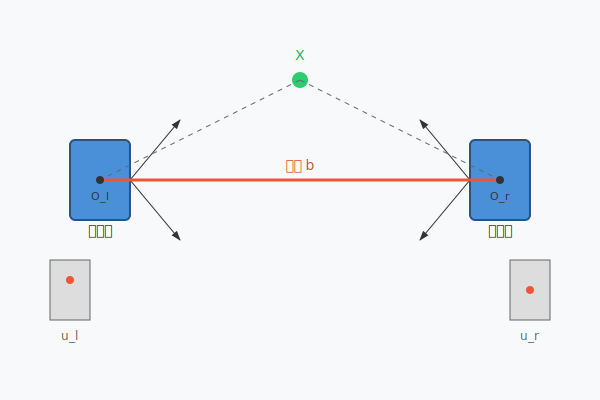
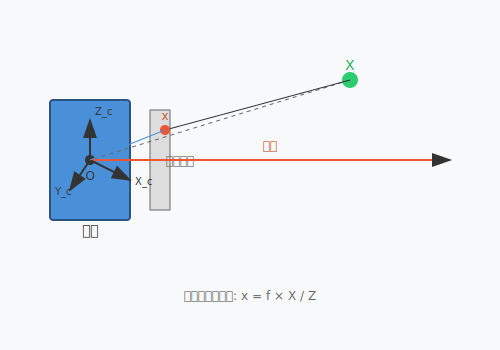
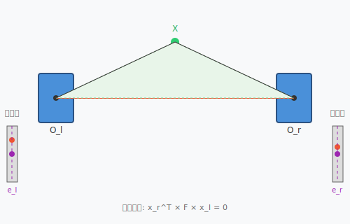
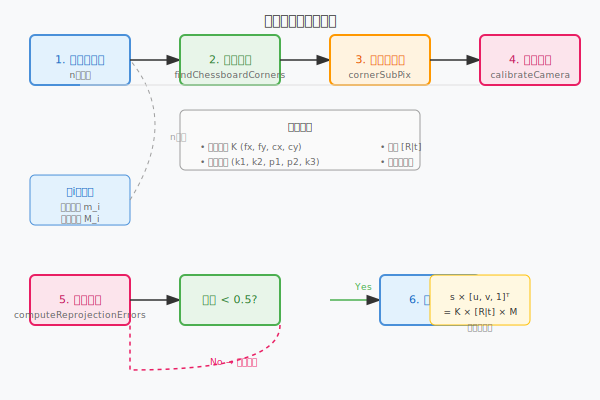
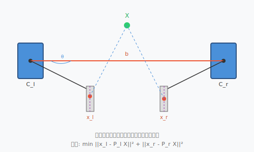
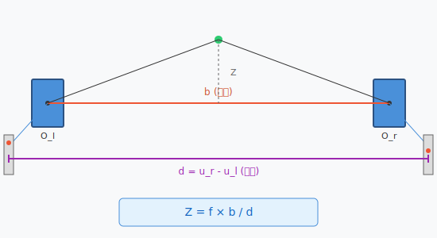

## 概述

双摄标定（Stereo Calibration）是计算机视觉中的基础问题，旨在建立两个摄像头之间的几何关系。本文从针孔模型出发，逐步推导双摄标定的核心公式。



## 1. 摄像头模型

### 1.1 针孔相机模型



在理想针孔相机中，三维空间点 $\mathbf{X} = [X, Y, Z]^T$ 与其在图像平面上的投影 $\mathbf{x} = [u, v]^T$ 满足相似三角形关系：

$$
\begin{bmatrix} u \\ v \\ 1 \end{bmatrix} = \frac{1}{Z} \begin{bmatrix} f_x & 0 & c_x \\ 0 & f_y & c_y \\ 0 & 0 & 1 \end{bmatrix} \begin{bmatrix} X \\ Y \\ Z \end{bmatrix}
$$

简写为：

$$
s \mathbf{x} = \mathbf{K} \mathbf{X}
$$

其中：
- $s$ 为深度缩放因子
- $\mathbf{K}$ 为**内参矩阵**（Intrinsic Matrix）
- $f_x, f_y$ 为焦距（像素单位）
- $c_x, c_y$ 为主点坐标

### 1.2 内参矩阵

$$
\mathbf{K} = \begin{bmatrix} f_x & 0 & c_x \\ 0 & f_y & c_y \\ 0 & 0 & 1 \end{bmatrix}
$$

内参矩阵描述了摄像机的内部几何特性，在单目相机标定中学习。

## 2. 外参与坐标系变换


### 2.1 世界坐标系到相机坐标系

设世界坐标系下一点 $\mathbf{X}_w$，其在相机坐标系下的坐标为 $\mathbf{X}_c$，满足：

$$
\mathbf{X}_c = \mathbf{R} \mathbf{X}_w + \mathbf{t}
$$

其中 $\mathbf{R}$ 是 $3 \times 3$ 旋转矩阵，$\mathbf{t}$ 是 $3 \times 1$ 平移向量。

齐次形式：

$$
\begin{bmatrix} \mathbf{X}_c \\ 1 \end{bmatrix} = \begin{bmatrix} \mathbf{R} & \mathbf{t} \\ \mathbf{0}^T & 1 \end{bmatrix} \begin{bmatrix} \mathbf{X}_w \\ 1 \end{bmatrix}
$$

### 2.2 相机坐标系到图像坐标系

结合内参，得到完整的投影方程：

$$
s \begin{bmatrix} u \\ v \\ 1 \end{bmatrix} = \mathbf{K} (\mathbf{R} \mathbf{X}_w + \mathbf{t})
$$

## 3. 双摄几何



### 3.1 立体视觉配置

设左相机坐标系为参考，右相机相对于左相机的变换为：

$$
\mathbf{X}_r = \mathbf{R}_r \mathbf{X}_l + \mathbf{t}_r
$$

### 3.2 极线几何约束

对于空间任意点 $\mathbf{X}$，其在左右图像上的投影 $\mathbf{x}_l$ 和 $\mathbf{x}_r$ 满足**极线约束**：

$$
\mathbf{x}_r^T \mathbf{F} \mathbf{x}_l = 0
$$

其中 $\mathbf{F}$ 为**基础矩阵**（Fundamental Matrix）。

## 4. 基础矩阵推导

### 4.1 定义

设左相机内参 $\mathbf{K}_l$，右相机内参 $\mathbf{K}_r$，两相机相对运动 $(\mathbf{R}, \mathbf{t})$。

### 4.2 推导过程

1. 左图像点 $\mathbf{x}_l$ 对应空间射线：

$$
\mathbf{X}_l = \lambda_l \mathbf{K}_l^{-1} \mathbf{x}_l
$$

2. 该点在右相机坐标系下：

$$
\mathbf{X}_r = \mathbf{R} \mathbf{X}_l + \mathbf{t}
$$

3. 投影到右图像：

$$
\mathbf{x}_r = \frac{1}{\lambda_r} \mathbf{K}_r \mathbf{X}_r
$$

4. 消去 $\mathbf{X}_l$：

$$
\mathbf{X}_r = \mathbf{R} (\lambda_l \mathbf{K}_l^{-1} \mathbf{x}_l) + \mathbf{t}
$$

5. 由于 $\mathbf{x}_r^T \mathbf{X}_r = 0$（向量垂直）：

$$
\mathbf{x}_r^T (\mathbf{R} \mathbf{K}_l^{-1} \mathbf{x}_l) \lambda_l + \mathbf{x}_r^T \mathbf{t} = 0
$$

6. 消去尺度因子：

$$
\mathbf{x}_r^T \mathbf{t}_\times \mathbf{R} \mathbf{K}_l^{-1} \mathbf{x}_l = 0
$$

其中 $\mathbf{t}_\times$ 为平移向量的反对称矩阵。

### 4.3 基础矩阵定义

$$
\mathbf{F} = \mathbf{K}_r^{-T} \mathbf{t}_\times \mathbf{R} \mathbf{K}_l^{-1}
$$

或等价的：

$$
\mathbf{F} = \mathbf{K}_r^{-T} \mathbf{E} \mathbf{K}_l^{-1}
$$

其中 $\mathbf{E} = \mathbf{t}_\times \mathbf{R}$ 为**本质矩阵**。

## 5. 本质矩阵

### 5.1 定义

本质矩阵（Essential Matrix）描述了两个相机之间的相对运动：

$$
\mathbf{E} = \mathbf{t}_\times \mathbf{R}
$$

### 5.2 性质

- $\mathbf{E}$ 是 $3 \times 3$ 矩阵
- $\det(\mathbf{E}) = 0$（不满秩）
- $\mathbf{E}$ 有 5 个自由度（3 旋转 + 3 平移 - 1 尺度 = 5）
- $\mathbf{E}$ 的两个奇异值相等（$\sigma_1 = \sigma_2$）

### 5.3 从本质矩阵恢复 $(\mathbf{R}, \mathbf{t})$

通过 SVD 分解：

$$
\mathbf{E} = \mathbf{U} \mathbf{\Sigma} \mathbf{V}^T
$$

其中 $\mathbf{\Sigma} = \text{diag}(\sigma, \sigma, 0)$。

恢复旋转矩阵：

$$
\mathbf{R} = \mathbf{U} \mathbf{W} \mathbf{V}^T \quad \text{或} \quad \mathbf{U} \mathbf{W}^T \mathbf{V}^T
$$

其中 $\mathbf{W} = \begin{bmatrix} 0 & -1 & 0 \\ 1 & 0 & 0 \\ 0 & 0 & 1 \end{bmatrix}$。

恢复平移向量（归一化）：

$$
\mathbf{t} = \mathbf{U}(:, 2)
$$

## 6. 单应矩阵

### 6.1 定义

当所有空间点位于同一平面时，点对应关系可用单应矩阵（Homography）描述：

$$
\mathbf{x}_r = \mathbf{H} \mathbf{x}_l
$$

### 6.2 单应矩阵计算

$$
\mathbf{H} = \mathbf{K}_r (\mathbf{R} - \frac{\mathbf{t}\mathbf{n}^T}{d}) \mathbf{K}_l^{-1}
$$

其中 $\mathbf{n}$ 为平面法向量，$d$ 为平面距离。

### 6.3 DLT 算法

给定 $n \geq 4$ 个对应点，通过直接线性变换（DLT）求解 $\mathbf{H}$：

$$
\begin{bmatrix} -u_r^l & -v_r^l & -1 & 0 & 0 & 0 & u_l u_r^l & v_l u_r^l & u_r^l \\ 0 & 0 & 0 & -u_r^l & -v_r^l & -1 & u_l v_r^l & v_l v_r^l & v_r^l \\ \vdots & \vdots & \vdots & \vdots & \vdots & \vdots & \vdots & \vdots & \vdots \end{bmatrix} \mathbf{h} = 0
$$

解为 $\mathbf{A}\mathbf{h}=0$ 最小奇异值对应的右奇异向量。

## 7. 双摄标定流程



### 7.1 张正友标定法

1. 拍摄 $n$ 张棋盘格图像
2. 检测角点坐标 $\mathbf{m}_{ij}$
3. 计算每张图像的单应矩阵 $\mathbf{H}_i$
4. 由内参约束求解 $\mathbf{K}$
5. 计算外参 $(\mathbf{R}_i, \mathbf{t}_i)$
6. 优化求解所有参数

### 7.2 内参约束

从单应矩阵分解得到：

$$
\mathbf{K}^{-T} \mathbf{K}^{-1} = \sum_{i=1}^{n} \mathbf{H}_i \mathbf{A} \mathbf{H}_i^T
$$

其中 $\mathbf{A}$ 是与内参相关的对称矩阵。

### 7.3 最大似然估计

建立最小化重投影误差的目标函数：

$$
\min_{\mathbf{K}, \mathbf{R}_i, \mathbf{t}_i, \mathbf{X}_j} \sum_i \sum_j \| \mathbf{m}_{ij} - \hat{\mathbf{m}}(\mathbf{K}, \mathbf{R}_i, \mathbf{t}_i, \mathbf{X}_j) \|^2
$$

使用 LM 算法迭代优化。

## 8. 双目校正


### 8.1 极线校正目的

将两幅图像的极线调整到水平对齐，使对应点搜索从 2D 降为 1D。

### 8.2 校正后基础矩阵

理想情况下：

$$
\mathbf{F}_{\text{rect}} = \begin{bmatrix} 0 & 0 & 0 \\ 0 & 0 & -1/f \\ 0 & 1/f & 0 \end{bmatrix}
$$

### 8.3 校正变换

计算左右相机的校正旋转矩阵 $\mathbf{R}_l$ 和 $\mathbf{R}_r$：

1. 计算旋转矩阵使极线水平：

$$
\mathbf{R}_{\text{rect}} = \mathbf{R}_{\text{rot}} \mathbf{R}_0
$$

2. 重新计算内参（可能需要裁剪图像）

## 9. 深度恢复

### 9.1 三角测量



已知对应点 $\mathbf{x}_l$ 和 $\mathbf{x}_r$，求空间点 $\mathbf{X}$：

$$
\hat{\mathbf{X}} = \arg\min_{\mathbf{X}} \| \mathbf{x}_l - \mathbf{P}_l \mathbf{X} \|^2 + \| \mathbf{x}_r - \mathbf{P}_r \mathbf{X} \|^2
$$

### 9.2 深度公式



$$
Z = \frac{f \cdot b}{d}
$$

其中：
- $Z$ 为深度
- $f$ 为焦距
- $b$ 为基线距离（两相机光心距离）
- $d = u_l - u_r$ 为视差（Disparity）

### 9.3 深度与视差关系

| 深度 $Z$ | 视差 $d$ | 特性 |
|----------|----------|------|
| 近 | 大 | 深度分辨率高 |
| 远 | 小 | 深度分辨率低 |
| 无穷远 | $d=0$ | 无法区分 |

这就是为什么深度估计在近距离更准确的原因。

## 10. 代码实现

### 10.1 OpenCV 双目标定

```python
import cv2
import numpy as np

# 准备棋盘格角点
objp = np.zeros((9*6, 3), np.float32)
objp[:, :2] = np.mgrid[0:9, 0:6].T.reshape(-1, 2)

# 存储所有图像的角点和对应关系
objpoints = []  # 3D points
imgpointsl = []  # 2D left image points
imgpointsr = []  # 2D right image points

# 标定
ret, mtx, dist, rvecs, tvecs = cv2.stereoCalibrate(
    objpoints, imgpointsl, imgpointsr,
    mtx_l, dist_l, mtx_r, dist_r,
    image_size, None, None,
    flags=cv2.CALIB_FIX_INTRINSIC
)

# 校正
R1, R2, P1, P2, Q, _, _ = cv2.stereoRectify(
    mtx_l, dist_l, mtx_r, dist_r,
    image_size, R, t, flags=cv2.CALIB_ZERO_DISPARITY
)

# 校正映射
mapl1, mapl2 = cv2.initUndistortRectifyMap(mtx_l, dist_l, R1, P1, image_size, cv2.CV_16SC2)
mapr1, mapr2 = cv2.initUndistortRectifyMap(mtx_r, dist_r, R2, P2, image_size, cv2.CV_16SC2)

# 应用校正
imgL_rect = cv2.remap(imgL, mapl1, mapl2, cv2.INTER_LINEAR)
imgR_rect = cv2.remap(imgR, mapr1, mapr2, cv2.INTER_LINEAR)
```

### 10.2 本质矩阵计算

```python
# 从匹配点计算基础矩阵
pts1 = np.float32(pts1)
pts2 = np.float32(pts2)

F, mask = cv2.findFundamentalMat(pts1, pts2, cv2.FM_RANSAC)

# 计算本质矩阵
E = mtx_r.T @ F @ mtx_l

# 分解本质矩阵
U, S, Vt = np.linalg.svd(E)
W = np.array([[0, -1, 0], [1, 0, 0], [0, 0, 1]])

R1 = U @ W @ Vt
R2 = U @ W.T @ Vt
t = U[:, 2]
```

### 10.3 三角测量

```python
# 三角测量恢复深度
points_4D = cv2.triangulatePoints(P1, P2, pts1.T, pts2.T)
points_3D = points_4D[:3] / points_4D[3]  # 归一化

# 计算深度
depth = points_3D[2]
```

## 11. 标定精度影响因素

| 因素 | 影响 | 优化方法 |
|------|------|----------|
| 棋盘格质量 | 角点检测精度 | 使用高精度打印 |
| 标定板位姿 | 参数可观测性 | 多角度拍摄 15-20 张 |
| 基线距离 | 深度精度 vs 匹配难度 | 适中（焦距的 5%-15%） |
| 分辨率 | 角点亚像素精度 | 足够高的分辨率 |
| 镜头畸变 | 校正残差 | 选择低畸变镜头 |
| 光照条件 | 角点检测 | 均匀良好光照 |

## 12. 常见问题与解决

### 12.1 左右图像点不匹配

**问题**：特征匹配出现错误匹配。

**解决**：
- 使用极线约束筛选
- 检查匹配点对极线误差
- 迭代优化剔除离群点

### 12.2 标定结果不稳定

**问题**：内外参估计方差大。

**解决**：
- 增加标定图像数量
- 确保标定板覆盖视野各个区域
- 使用更稳定的特征检测算法

### 12.3 深度估计误差大

**问题**：三角测量精度不足。

**解决**：
- 确保校正精度
- 增加基线距离（适中）
- 使用立体匹配细化对应点

## 13. 资源链接

- [OpenCV Stereo Calibration](https://docs.opencv.org/4.x/dd/d52/tutorial_js_calibration3d.html)
- [Middlebury Stereo Dataset](https://vision.middlebury.edu/stereo/data/)
- [KITTI Stereo Dataset](https://www.cvlibs.net/datasets/kitti/)
- [Zhang's Camera Calibration](https://www.microsoft.com/en-us/research/wp-content/uploads/2002/02/tr-98-93.pdf)

## 14. 插图说明

本文中引用的插图已创建为 SVG 图形（存放于 `docs/blog/images/` 目录）：

| 文件名 | 说明 |
|--------|------|
| `stereo-calibration-overview.svg` | 双摄系统整体示意图，展示左右相机、基线、场景 |
| `pinhole-camera-model.svg` | 针孔相机模型，点投影关系 |
| `coordinate-transformation.svg` | 世界坐标系到相机坐标系的变换 |
| `epipolar-geometry.svg` | 极线几何图，展示基线、极点、极面、极线 |
| `depth-disparity.svg` | 深度-视差关系图，平行双摄构型 |
| `stereo-rectification.svg` | 校正前后对比图 |
| `triangulation.svg` | 三角测量示意图 |
| `calibration-flowchart.svg` | 张正友标定法流程图 |