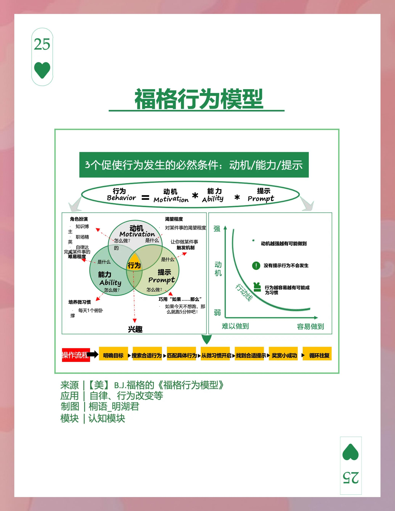

> 解锁微小改变的巨大力量

你是否曾经下定决心要健身、学习新技能或培养好习惯，最终却无疾而终？或许问题不在于你的意志力，而在于你改变的方法。今天，我想与你分享一个能彻底改变你行为改变方式的神奇模型——福格行为模型。

## 什么是福格行为模型？

福格行为模型由斯坦福大学教授BJ·福格提出，用一个简洁的公式表示为：**B = MAP**

即：**行为(Behavior) = 动机(Motivation) + 能力(Ability) + 提示(Prompt)**

这三个要素必须同时存在，行为才会发生。就像电灯需要电源、完整的电路和开关操作才能亮起一样。

## 深入理解三大要素

### 1. 动机（Motivation）
动机是我们行动的欲望，但它也是最不可靠的因素。福格博士将动机分为三类：
- 个人层面：你的内在渴望、愉悦或痛苦
- 社会环境层面：同辈压力、社会接纳或拒绝
- 行动本身：对奖励的期待或对惩罚的恐惧

关键洞见：**不要过度依赖动机**，因为它像天气一样多变。

### 2. 能力（Ability）
能力指执行某一行为的容易程度。福格提出了“能力链”的五个维度：
- 时间：你有足够的时间吗？
- 资金：你能负担得起吗？
- 体力：你有足够的体力完成吗？
- 脑力：这个行为容易理解吗？
- 日程：它适合你的日常安排吗？

降低行为难度的黄金法则是：**让它变得简单到不可能失败**。

### 3. 提示（Prompt）
提示是行为的触发器，没有提示，即使动机和能力再强，行为也不会发生。常见的提示包括：
- 情境提示：手机通知、便利贴
- 行为锚定：将新习惯与已有习惯绑定
- 情绪提示：特定情绪状态触发的行为

## 福格行为模型的实践应用

### 培养新习惯的秘诀
想要建立持久的习惯？关键在于从**微小行为**开始：
- 不是“每天做50个俯卧撑”，而是“每天做2个俯卧撑”
- 不是“每天冥想30分钟”，而是“每天深呼吸一次”
- 不是“写2000字文章”，而是“写一句话”

这些“小到不可能失败”的行为会逐渐建立你的信心和能力，最终形成牢固的习惯。

### 打破不良习惯的策略
要戒除坏习惯，反向操作即可：
- 削弱动机：将坏习惯与负面感受关联
- 增加难度：设置障碍，让执行变困难
- 消除提示：移除触发坏习惯的线索

## 为什么这个模型如此有效？

福格行为模型之所以强大，是因为它：
1. **尊重人性**：承认动机的波动性，不依赖意志力
2. **注重可行性**：强调从微小、可持续的改变开始
3. **系统化思考**：考虑行为的全部要素，而非单一因素
