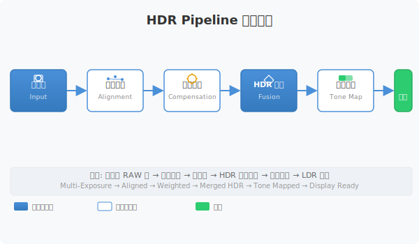
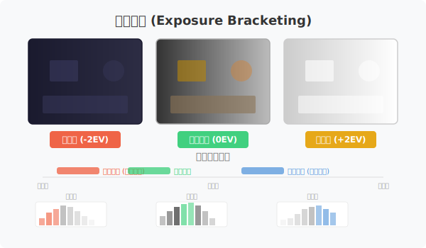
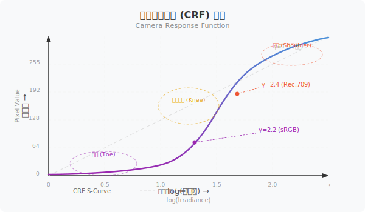
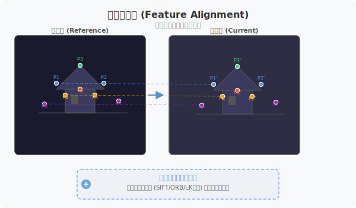
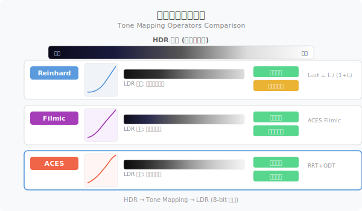
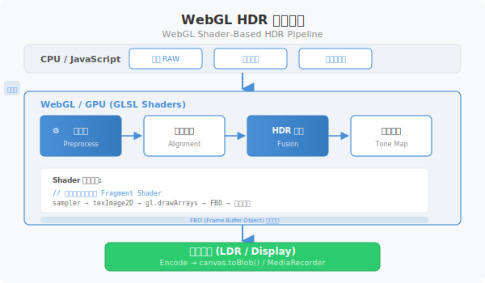

## 1. HDR 概述与多帧合成原理



### 1.1 什么是 HDR

HDR（High Dynamic Range，高动态范围）是一种扩展图像动态范围的技术。现实场景中的亮度范围可以从 $10^3$ cd/m²（阴影）到 $10^6$ cd/m²（阳光直射），而普通显示器只能显示约 $10^3$ 的动态范围。

HDR 的核心目标是：
- **捕获**: 保留更多亮部和暗部细节
- **映射**: 将高动态范围映射到可显示范围
- **呈现**: 在有限动态范围的设备上还原真实感

### 1.2 单帧 vs 多帧

**单帧 HDR** 依赖传感器硬件能力（如像素级 HDR、交织式 HDR），但存在以下局限：
- 噪声放大严重
- 运动物体易产生鬼影
- 动态范围提升有限

**多帧 HDR** 通过拍摄多张不同曝光的图像，融合后获得更高的动态范围：
- 曝光不足帧（Low Exposure）: 保留亮部细节
- 正常曝光帧（Normal Exposure）: 保留中间调
- 曝光过度帧（High Exposure）: 保留暗部细节

### 1.3 应用场景



| 场景 | 需求 |
|------|------|
| 手机摄影 | 实时 HDR 拍照、夜景模式 |
| 专业摄影 | 风光摄影、商业摄影 |
| 工业检测 | 精密测量、缺陷检测 |
| 医学影像 | X光/CT 图像增强 |
| 自动驾驶 | 车载相机 HDR、隧道场景 |

### 1.4 多帧合成基本流程

```
┌──────────┐  ┌──────────┐  ┌──────────┐
│ 低曝光帧  │  │ 正常曝光帧 │  │ 高曝光帧  │
└─────┬────┘  └─────┬────┘  └─────┬────┘
      │            │            │
      └────────────┼────────────┘
                   ▼
            ┌────────────┐
            │ 特征对齐    │
            │ 曝光补偿    │
            └─────┬──────┘
                  ▼
            ┌────────────┐
            │ HDR 融合   │
            │ (辐照度图) │
            └─────┬──────┘
                  ▼
            ┌────────────┐
            │ 色调映射    │
            │ Tone Map   │
            └─────┬──────┘
                  ▼
            ┌────────────┐
            │ 8-bit 输出  │
            │ LDR 图像    │
            └────────────┘
```

## 2. 相机响应函数与曝光模型



### 2.1 相机响应函数（CRF）

相机响应函数描述了场景辐照度 $E$ 与像素值 $Z$ 之间的关系：

$$
Z = f(E \cdot t)
$$

其中：
- $f$ 为相机响应函数（非线性）
- $E$ 为场景辐照度（ irradiance ）
- $t$ 为曝光时间

### 2.2 逆向恢复

为了从多帧曝光中恢复 HDR 辐照度，需要先估计逆向响应函数 $f^{-1}$：

$$
\ln E = \frac{\ln Z - \ln f^{-1}}{t}
$$

### 2.3 伽马校正

大多数相机的响应函数可近似为伽马曲线：

$$
Z = 255 \cdot \left(\frac{E}{E_{sat}}\right)^{\gamma}
$$

其中 $\gamma \approx 2.2$（部分相机使用 2.4）。

### 2.4 曝光包围策略

合理的曝光包围应满足：
- 相邻帧曝光比约为 2:1（1 EV 间隔）
- 最少 3 帧（低/中/高）
- 确保所有区域都有"好"的曝光帧

### 2.5 常用 CRF 估计方法

| 方法 | 优点 | 缺点 |
|------|------|------|
| Debevec-Malik | 精度高、理论基础好 | 需要多帧、计算量大 |
| Mitsunaga | 无需对应点 | 需要亮度单调假设 |
| Grossberg | 可同时估计多种光源 | 实现复杂 |

## 3. 全流程 Pipeline 设计

### 3.1 RAW 读取与预处理

**关键步骤**:
1. **坏点校正**: 检测并插值坏像素点
2. **暗电流补偿**: 减去 Dark Frame 的固定模式噪声
3. **露天污点校正**: 去除 FPN（Fixed Pattern Noise）
4. **白平衡**: 移除光源色偏

### 3.2 特征对齐与曝光补偿



**对齐策略**:
- 特征点检测：ORB（Oriented FAST and Rotated BRIEF）
- 光流估计：Lucas-Kanade 稠密光流
- 亚像素细化：Guided Filter

**曝光补偿**:
- 使用 Debevec-Malik 算法估计 CRF
- 反演每帧到线性辐照度空间

### 3.3 多曝光融合算法

**Mertens Merge（权重融合）**:

$$
W = w_c \cdot w_s \cdot w_e
$$

其中：
- $w_c$：对比度权重（梯度强度）
- $w_s$：饱和度权重
- $w_e$：曝光质量权重（接近 0.5 的像素更优）

**神经网络融合**:
- Edge-aware HDR Fusion
- 轻量级模型（~500K 参数）
- INT8 量化适配移动端

### 3.4 色调映射（Tone Mapping）



| 算法 | 特点 | 适用场景 |
|------|------|----------|
| Reinhard | 全局映射，简单高效 | 实时应用 |
| Filmic | 仿胶片曲线，细节保留好 | 电影感 |
| ACES | 学院标准，色彩准确 | 专业后期 |
| Multi-scale TM | 局部映射，避免光晕 | 高端显示 |

### 3.5 16-bit 输出与编码

融合结果为 16-bit HDR 图像，需要编码为可用格式：

$$
HDR_{output} = \frac{HDR_{linear}}{HDR_{linear} + 1} \cdot 65535
$$

## 4. 嵌入式实现（ARM + OpenCL）


### 4.1 技术栈

| 组件 | 技术选型 |
|------|----------|
| 语言 | C++17 |
| 计算加速 | OpenCL 1.2 / OpenVX 1.2 |
| AI 加速 | Android NNAPI |
| 图像编解码 | libjpeg-turbo / libheif |
| 构建 | CMake + NDK |

### 4.2 OpenCL Kernel 设计

**坏点校正 Kernel**:

```cpp
__kernel void bad_pixel_correction(
    __global const ushort* raw_input,
    __global ushort* raw_output,
    const int width,
    const int height,
    __global const int* bad_pixels,
    const int bad_pixel_count)
{
    int idx = get_global_id(0);
    int x = idx % width;
    int y = idx / width;

    for (int i = 0; i < bad_pixel_count; i++) {
        if (bad_pixels[i*2] == x && bad_pixels[i*2+1] == y) {
            // 双线性插值
            raw_output[idx] = bilinear_interpolate(raw_input, x, y, width, height);
            return;
        }
    }
    raw_output[idx] = raw_input[idx];
}
```

**Mertens 权重融合 Kernel**:

```cpp
__kernel void mertens_fusion(
    __global const uchar* frames[],      // 多帧输入
    __global float* output,
    const int width,
    const int height,
    const int frame_count)
{
    int idx = get_global_id(0);
    float weight_sum = 0.0f;
    float3 hdr = (float3)(0.0f);

    for (int i = 0; i < frame_count; i++) {
        float contrast = get_contrast(frames[i], idx, width, height);
        float saturation = get_saturation(frames[i], idx);
        float exposure = get_exposure_quality(frames[i], idx);

        float w = contrast * saturation * exposure;
        hdr += convert_to_float3(frames[i], idx) * w;
        weight_sum += w;
    }

    output[idx] = hdr / weight_sum;
}
```

### 4.3 NNAPI 模型加载

```cpp
// 加载量化 ONNX 模型
NNmodel model = NNmodel::createFromFd(model_fd);
NNCompilation compilation = model.compile<int8_t>({
    .allowMultipleInputsOutputs = true,
    .performancePreference = PERFORMANCE_PREFERENCE_HIGH_QUALITY
});
```

### 4.4 性能调优

| 优化项 | 方法 | 预期收益 |
|--------|------|----------|
| 内存拷贝 | DMA 异步传输 | 减少 30% 拷贝时间 |
| 流水线 | 重叠计算与内存操作 | 提升 40% 吞吐 |
| 缓存 | L1/L2 缓存优化 | 减少内存带宽压力 |
| 量化 | INT8 vs FP32 | 2-4x 加速 |

## 5. 云端 WebGL/WASM 实现



### 5.1 技术栈

| 组件 | 技术选型 |
|------|----------|
| GPU 计算 | WebGL 2.0 |
| 原生库 | WASM 编译（libjpeg、libheif） |
| 流程控制 | JavaScript |
| 模型推理 | TensorFlow.js |

### 5.2 WebGL 渲染管线

```javascript
// 创建 HDR Framebuffer
const hdrFramebuffer = gl.createFramebuffer();
gl.bindFramebuffer(gl.FRAMEBUFFER, hdrFramebuffer);

const hdrTexture = gl.createTexture();
gl.bindTexture(gl.TEXTURE_2D, hdrTexture);
gl.texImage2D(gl.TEXTURE_2D, 0, gl.RGBA16F, width, height, 0, gl.RGBA, gl.HALF_FLOAT, null);
gl.framebufferTexture2D(gl.FRAMEBUFFER, gl.COLOR_ATTACHMENT0, gl.TEXTURE_2D, hdrTexture, 0);
```

### 5.3 色调映射 Shader

```glsl
precision highp float;

uniform sampler2D uHDRTexture;
uniform float uExposure;
uniform int uTMType; // 0=Reinhard, 1=Filmic, 2=ACES

varying vec2 vTexCoord;

vec3 reinhard(vec3 color) {
    return color / (color + vec3(1.0));
}

vec3 filmic(vec3 color) {
    color = max(vec3(0.0), color - 0.004);
    color = (color * (6.2 * color + 0.5)) / (color * (6.2 * color + 1.7) + 0.06);
    return color;
}

vec3 toACES(vec3 x) {
    return clamp((x * (2.51 * x + 0.03)) / (x * (2.43 * x + 0.59) + 0.14), 0.0, 1.0);
}

void main() {
    vec3 hdr = texture2D(uHDRTexture, vTexCoord).rgb * uExposure;
    vec3 mapped;
    if (uTMType == 0) mapped = reinhard(hdr);
    else if (uTMType == 1) mapped = filmic(hdr);
    else mapped = toACES(hdr);
    gl_FragColor = vec4(mapped, 1.0);
}
```

### 5.4 WASM 编码

```javascript
// 使用 jpeg-js 编码 JPEG HDR
import JSDOM from 'jpeg-js';
const rawImageData = {
    data: Float32Array.from(hdrPixels),
    width, height
};
const jpegImage = JSDOM.encode(rawImageData, { quality: 95 });
```

### 5.5 性能目标

| 指标 | 目标 |
|------|------|
| 分辨率 | 4K (3840x2160) |
| 处理时间 | < 2s |
| 内存占用 | < 512MB |

## 6. 输出格式对比与选择

### 6.1 格式对比表

| 格式 | 位深 | 压缩 | 兼容性 | 元数据 | 推荐场景 |
|------|------|------|--------|--------|----------|
| PNG 16-bit | 16 | 无损 | 通用 | 有限 | 工业/科研/存档 |
| JPEG HDR | 12 | 高 | 现代设备 | 完整 | 日常摄影/分享 |
| HEIF | 10-12 | 高 | iOS/新Android | 完整 | 高效存储/流媒体 |
| TIFF 16-bit | 16 | 可选 | 专业软件 | 完整 | 专业后期处理 |

### 6.2 场景化推荐

| 场景 | 推荐格式 | 理由 |
|------|----------|------|
| 手机摄影 | HEIF (HDR10) | 高压缩、硬件支持 |
| 专业摄影 | TIFF 16-bit + JPEG HDR 双备份 | 无损存档 + 快速分享 |
| 工业检测 | PNG 16-bit | 无损、无压缩伪影 |
| Web 显示 | JPEG HDR + LDR 双版本 | 兼容新旧设备 |

### 6.3 兼容性说明

| 平台 | JPEG HDR | HEIF HDR | PNG 16-bit |
|------|---------|----------|-----------|
| iOS 13+ | ✅ | ✅ | ✅ |
| Android 10+ | ✅ | ❌ (需第三方) | ✅ |
| Chrome 90+ | ✅ | ❌ | ✅ |
| 老设备 | ❌ (降级 LDR) | ❌ | ✅ |

### 6.4 元数据支持

```javascript
// JPEG HDR 元数据（ICC Profile + HDR10）
{
    colorSpace: 'bt2020nc',
    transferFunction: 'pq',
    primaries: 'bt2020',
    maxLuminance: 1000,
    minLuminance: 0.001
}
```

## 7. 常见问题与调优

### 7.1 鬼影（Ghost）抑制

**问题**: 多帧间运动物体导致重影

**原因分析**:
- 相机抖动导致帧间偏移
- 运动物体在不同帧中位置不同
- 融合权重未考虑运动区域

**解决策略**:

| 策略 | 实现方法 | 效果 |
|------|----------|------|
| 特征匹配筛选 | 剔除匹配误差 > 2px 的特征点 | 基础去鬼影 |
| 曝光权重调整 | 降低运动区域的融合权重 | 保留主体清晰 |
| 运动检测 | 帧差法标记运动区域 | 智能处理 |
| 光流一致性 | 双向光流一致性检测 | 精确分割 |

### 7.2 噪声放大控制

**问题**: 暗部曝光过度帧噪声被放大

**原因分析**:
- 暗部区域依赖高曝光帧
- 高曝光帧本身噪声较大
- 融合后噪声叠加

**解决策略**:

| 策略 | 实现方法 | 效果 |
|------|----------|------|
| 多帧降噪 | 融合前时空域降噪 | 基础降噪 |
| 权重平滑 | 曝光权重考虑噪声水平 | 自适应降噪 |
| Bilateral Filter | 保边降噪 | 细节保持 |
| BM3D | 频域协同滤波 | 专业级降噪 |

### 7.3 色调偏移修正

**问题**: 融合后色温/色调偏离

**原因分析**:
- 多帧白平衡不一致
- 光源色偏未被完全校正
- 融合算法引入色偏

**解决策略**:

1. **全局白平衡校正**: 在融合前统一白平衡
2. **直方图匹配**: 匹配到参考帧色彩分布
3. **色彩空间融合**: 在 Lab 空间进行融合

### 7.4 性能调优参数

| 参数 | 推荐值 | 说明 |
|------|--------|------|
| 对齐搜索窗口 | 64px | 特征匹配搜索范围 |
| 光流金字塔层数 | 4 | 粗细策略层数 |
| 融合权重模糊 | 7px | Mertens 权重平滑半径 |
| TM 曝光调整 | 0.5-2.0 | 根据场景调整 |
| 最大特征点数 | 2000 | ORB 特征点上限 |
| 光流迭代次数 | 30 | Lucas-Kanade 迭代 |

### 7.5 调试 checklist

- [ ] RAW 文件是否正确读取？
- [ ] 坏点是否被正确校正？
- [ ] 特征对齐误差是否 < 1px？
- [ ] 融合结果是否有明显鬼影？
- [ ] 色调映射后是否有过曝/欠曝？
- [ ] 输出格式是否满足位深要求？
- [ ] 处理时间是否在预算内？
