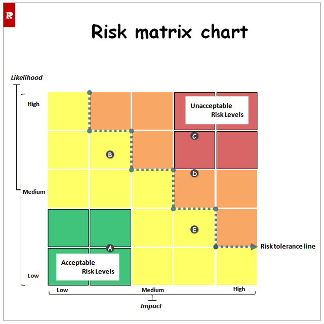

在日常工作中，我们每天都在与风险共舞。一个新功能的开发可能延期，一次市场活动可能效果不佳，一个供应商可能突然掉链子......

面对这些无处不在的不确定性，我们该如何应对？是草木皆兵、耗费大量资源去防范每一个微小风险，还是听天由命、等到问题爆发才手忙脚乱？

答案在于**优先级**。而风险矩阵，正是帮助我们快速确定风险优先级，从而做出明智决策的绝佳工具。

## **一、什么是风险矩阵？**

简单来说，风险矩阵是一个**可视化工具**，它通过两个关键维度来评估风险：

1.  **可能性：** 风险事件发生的概率有多大？
2.  **影响程度：** 如果风险真的发生了，它造成的后果有多严重？

通过将这两个维度组合成一个网格，风险矩阵将风险划分到不同的区域，直观地告诉我们：**“应该重点关注什么？”**

一个典型的风险矩阵看起来是这样的：

## **二、为什么你需要风险矩阵？**

1.  **可视化沟通，达成共识**
    与其用模糊的文字描述（如“这个风险有点麻烦”），风险矩阵提供了一个清晰的框架。团队成员、管理层和客户可以基于同一套标准进行讨论，快速对风险的严重性达成一致理解。

2.  **聚焦关键，优化资源**
    资源（时间、人力、资金）总是有限的。风险矩阵帮助我们识别出那些“高可能性、高影响”的“红色区域”风险。我们应该将80%的精力投入到应对这20%的关键风险上，而不是平均用力。

3.  **支持决策，有理有据**
    当需要决定是否启动一个项目、是否要增加预算或是否采用备用方案时，风险矩阵提供了客观的决策依据。你可以指着矩阵说：“看，我们面临的主要是这些高风险，因此我们需要采取更积极的应对策略。”

## **三、如何一步步创建和使用风险矩阵？**

**步骤1：定义你的等级尺度**
在评估前，你需要为“可能性”和“影响程度”制定清晰的等级标准。

*   **可能性（Probability）**： 可以是1-5分，也可以是定性描述。
    *   1 - 极不可能
    *   2 - 不太可能
    *   3 - 可能
    *   4 - 较可能
    *   5 - 几乎肯定

*   **影响程度（Impact）**： 通常从成本、时间、质量、安全、声誉等多个角度衡量。
    *   1 - 可忽略： 微小超支/延迟，无感知影响。
    *   2 - 轻微： 需要额外资源，对部分任务有影响。
    *   3 - 中等： 项目目标受到明显挑战，需要管理层关注。
    *   4 - 严重： 导致主要目标失败，造成重大损失。
    *   5 - 灾难性： 项目彻底失败，对公司造成长期或不可逆的损害。

**步骤2：识别风险**
通过头脑风暴、专家访谈、查阅历史数据等方式，列出所有可能的风险。例如：“核心技术人员离职”、“关键技术依赖的第三方服务中断”、“市场需求突然变化”。

**步骤3：评估并绘制**
对每一个识别出的风险，讨论并确定其“可能性”和“影响程度”的得分。然后将它放到矩阵的对应格子里。

**步骤4：制定应对策略**
根据风险在矩阵中的位置，采取不同的策略：

*   **红色区域（高风险）：** **必须立即采取行动。** 你需要制定详细的缓解计划，并分配专人负责。目标是尽可能将其转移到黄色或绿色区域。
*   **黄色区域（中等风险）：** **需要密切关注和管理。** 制定应急计划，并定期监控其状态的变化。
*   **绿色区域（低风险）：** **可以接受。** 通常只需记录下来，保持关注即可，无需投入过多资源。

::openmoji:light-bulb =24:: **常见应对策略**

- 降低发生的可能性
- 降低发生后的危害
- 无法避免时，记得选择合适的姿势硬抗，记得提前做好准备
- 当然，你也可以选择，将风险转移给能解决或能扛得住的人，比如你老板
- 祸兮福之所倚，将危机转变成机会

## **四、避免常见的陷阱**

风险矩阵虽然强大，但使用不当也会效果打折：

*   **主观偏见：** 不同的人对风险的感知不同。解决方法是集体讨论，并尽量用事实和数据支撑。
*   **静态分析：** 风险不是一成不变的。项目进展、外部环境变化都会改变风险等级。**务必定期回顾和更新**你的风险矩阵。
*   **过度简化：** 有些风险的影响是连锁性的，一个风险可能引发另一个。在分析时要考虑到这种关联性。
*   **“黑箱”操作：** 风险矩阵制定后就被束之高阁。它应该是一个活的文档，在项目会议中被频繁讨论和审视。
