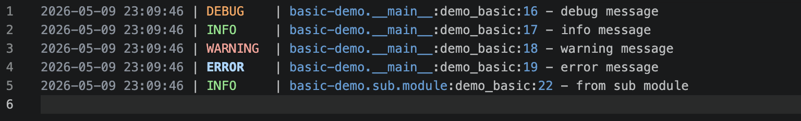

## Logger

- logger.py

```python :collapsed-lines
import json
import logging
import sys

from datetime import datetime, timezone
from logging.handlers import RotatingFileHandler, TimedRotatingFileHandler
from pathlib import Path
from typing import Any


# JSON formatter: outputs structured JSON logs for machine parsing
class JsonFormatter(logging.Formatter):

    def __init__(self, include_extra: bool = True):
        super().__init__()
        self.include_extra = include_extra

    def format(self, record: logging.LogRecord) -> str:
        log_data: dict[str, Any] = {
            "timestamp": datetime.now(timezone.utc).isoformat(),
            "level": record.levelname,
            "logger": record.name,
            "message": record.getMessage(),
            "module": record.module,
            "function": record.funcName,
            "line": record.lineno,
        }

        # Include exception info if present
        if record.exc_info:
            log_data["exception"] = self.formatException(record.exc_info)

        # Extract user-supplied extra fields by filtering out known LogRecord attributes
        if self.include_extra:
            extra_fields = {
                key: value
                for key, value in record.__dict__.items()
                if key
                not in {
                    "name",
                    "msg",
                    "args",
                    "created",
                    "filename",
                    "funcName",
                    "levelname",
                    "levelno",
                    "lineno",
                    "module",
                    "msecs",
                    "pathname",
                    "process",
                    "processName",
                    "relativeCreated",
                    "stack_info",
                    "exc_info",
                    "exc_text",
                    "asctime",
                    "thread",
                    "threadName",
                    "message",
                    "taskName",
                }
            }
            if extra_fields:
                log_data["extra"] = extra_fields

        return json.dumps(log_data, default=str)


# Plain text formatter: human-readable with optional ANSI color coding
class PlainTextFormatter(logging.Formatter):

    COLORS = {
        "DEBUG": "\033[36m",
        "INFO": "\033[32m",
        "WARNING": "\033[33m",
        "ERROR": "\033[31m",
        "CRITICAL": "\033[35m",
    }

    RESET = "\033[0m"

    def __init__(self, use_color: bool = True):
        super().__init__(
            fmt="%(asctime)s | %(levelname)-8s | %(name)s:%(funcName)s:%(lineno)d - %(message)s",
            datefmt="%Y-%m-%d %H:%M:%S",
        )
        self.use_color = use_color

    def format(self, record: logging.LogRecord) -> str:
        formatted = super().format(record)
        if self.use_color and record.levelname in self.COLORS:
            color = self.COLORS[record.levelname]
            # Wrap only the levelname portion with ANSI codes,
            # without modifying record.levelname (avoid leaking colors to other handlers)
            formatted = formatted.replace(
                f" {record.levelname:<8} ",
                f" {color}{record.levelname:<8}{self.RESET} ",
            )
        return formatted


# Central manager: creates and wires up console + file handlers
class LoggingManager:

    def __init__(
        self,
        app_name: str = "app",
        log_dir: str = "logs",
        level: int = logging.INFO,
        rotation: str = "size",
        max_bytes: int = 10 * 1024 * 1024,
        backup_count: int = 5,
        when: str = "midnight",
        interval: int = 1,
        json_format: bool = False,
        use_color: bool = True,
    ):
        self.app_name = app_name
        self.log_dir = Path(log_dir)
        self.level = level
        self.rotation = rotation
        self.max_bytes = max_bytes
        self.backup_count = backup_count
        self.when = when
        self.interval = interval
        self.json_format = json_format
        self.use_color = use_color
        # Cache of child loggers created under this manager's namespace
        self._loggers: dict[str, logging.Logger] = {}
        self._root_logger: logging.Logger | None = None
        # Ensure log directory exists at initialization
        self.log_dir.mkdir(parents=True, exist_ok=True)

    # Build a file handler with rotation (size-based or time-based)
    def _create_file_handler(self) -> logging.Handler:
        log_file = self.log_dir / f"{self.app_name}.log"

        # Choose handler type based on rotation strategy
        if self.rotation == "time":
            handler: logging.Handler = TimedRotatingFileHandler(
                filename=str(log_file),
                when=self.when,
                interval=self.interval,
                backupCount=self.backup_count,
                encoding="utf-8",
            )
        else:
            handler = RotatingFileHandler(
                filename=str(log_file),
                maxBytes=self.max_bytes,
                backupCount=self.backup_count,
                encoding="utf-8",
            )

        # Set formatter based on JSON vs plain text preference
        if self.json_format:
            handler.setFormatter(JsonFormatter())
        else:
            handler.setFormatter(
                logging.Formatter(
                    fmt="%(asctime)s | %(levelname)-8s | %(name)s:%(funcName)s:%(lineno)d - %(message)s",
                    datefmt="%Y-%m-%d %H:%M:%S",
                )
            )

        return handler

    # Build a stdout handler with plain text (and optional color)
    def _create_console_handler(self) -> logging.Handler:
        handler = logging.StreamHandler(sys.stdout)
        handler.setFormatter(PlainTextFormatter(use_color=self.use_color))
        return handler

    # Initialize the root logger: configures handlers and disables propagation
    def setup(self) -> logging.Logger:
        if self._root_logger is not None:
            return self._root_logger
        # Start with a clean logger for this app namespace
        logger = logging.getLogger(self.app_name)
        logger.setLevel(self.level)
        logger.handlers.clear()

        # Console handler goes to stdout with human-friendly formatting
        console_handler = self._create_console_handler()
        console_handler.setLevel(self.level)
        logger.addHandler(console_handler)

        # File handler goes to disk with rotation and structured formatting
        file_handler = self._create_file_handler()
        file_handler.setLevel(self.level)
        logger.addHandler(file_handler)

        # Prevent log events from propagating to the root Python logger
        logger.propagate = False

        self._root_logger = logger
        return logger

    # Get or cache a child logger under this manager's namespace
    def get_logger(self, name: str) -> logging.Logger:
        if self._root_logger is None:
            self.setup()

        # Return cached logger if it already exists
        if name in self._loggers:
            return self._loggers[name]

        # Create a new logger that inherits handlers and level from the root logger
        logger = logging.getLogger(f"{self.app_name}.{name}")
        logger.setLevel(self.level)
        logger.propagate = True

        self._loggers[name] = logger
        return logger

    @property
    def root_logger(self) -> logging.Logger:
        if self._root_logger is None:
            self.setup()
        return self._root_logger  # type: ignore


_default_manager: LoggingManager | None = None


# Convenience: initialize global manager once, then reuse
def init_logging(
    app_name: str = "app",
    log_dir: str = "logs",
    level: int = logging.INFO,
    rotation: str = "size",
    **kwargs,
) -> LoggingManager:
    global _default_manager
    _default_manager = LoggingManager(
        app_name=app_name,
        log_dir=log_dir,
        level=level,
        rotation=rotation,
        **kwargs,
    )
    _default_manager.setup()
    return _default_manager


# Quick access to a logger under the default manager (auto-init if needed)
def get_logger(name: str) -> logging.Logger:
    if _default_manager is None:
        init_logging()
    return _default_manager.get_logger(name)  # type: ignore


def create_size_rotated_logging(
    app_name: str = "app",
    log_dir: str = "logs",
    max_bytes: int = 10 * 1024 * 1024,
    backup_count: int = 5,
    **kwargs,
) -> LoggingManager:
    return init_logging(
        app_name=app_name,
        log_dir=log_dir,
        rotation="size",
        max_bytes=max_bytes,
        backup_count=backup_count,
        **kwargs,
    )


def create_time_rotated_logging(
    app_name: str = "app",
    log_dir: str = "logs",
    when: str = "midnight",
    interval: int = 1,
    backup_count: int = 7,
    **kwargs,
) -> LoggingManager:
    return init_logging(
        app_name=app_name,
        log_dir=log_dir,
        rotation="time",
        when=when,
        interval=interval,
        backup_count=backup_count,
        **kwargs,
    )
```

## Demo

- demo.py

```python :collapsed-lines
import logging

from logger import (
    LoggingManager,
    create_size_rotated_logging,
    create_time_rotated_logging,
    get_logger,
    init_logging,
)


def demo_basic():
    print("=== demo_basic: 控制台 + 文件 (纯文本) ===")
    mgr = init_logging(app_name="basic-demo", log_dir="logs/basic", level=logging.DEBUG)
    log = get_logger(__name__)
    log.debug("debug message")
    log.info("info message")
    log.warning("warning message")
    log.error("error message")

    sub_log = mgr.get_logger("sub.module")
    sub_log.info("from sub module")

    print("Output dir: logs/basic/\n")


def demo_json():
    print("=== demo_json: JSON format 文件输出 ===")
    init_logging(
        app_name="json-demo",
        log_dir="logs/json",
        level=logging.INFO,
        json_format=True,
    )
    log = get_logger(__name__)
    log.info("user login", extra={"user_id": 42, "ip": "192.168.1.1"})
    log.warning("rate limit exceeded", extra={"api": "/v1/data"})
    log.info("order created", extra={"order_id": "ORD-001", "amount": 99.9})

    print("Output dir: logs/json/\n")


def demo_exception():
    print("=== demo_exception: 异常栈追踪 ===")
    init_logging(
        app_name="exc-demo",
        log_dir="logs/exception",
        level=logging.ERROR,
        json_format=True,
    )
    log = get_logger(__name__)
    try:
        1 / 0
    except ZeroDivisionError:
        log.exception("division failed")
    print("Output dir: logs/exception/\n")


def demo_custom_manager():
    print("=== demo_custom_manager: 直接使用 LoggingManager ===")
    mgr = LoggingManager(
        app_name="custom-demo",
        log_dir="logs/custom",
        rotation="size",
        max_bytes=1024,  # 1KB for demo rotation
        backup_count=3,
        level=logging.DEBUG,
    )
    log = mgr.get_logger(__name__)
    for i in range(100):
        log.info(f"log line {i}")

    print("Output dir: logs/custom/ (try rotating with small max_bytes)\n")


def demo_time_rotation():
    print("=== demo_time_rotation: 按时间轮转 ===")
    create_time_rotated_logging(
        app_name="time-rotate-demo",
        log_dir="logs/time",
        when="H",
        interval=1,
        backup_count=3,
    )
    log = get_logger(__name__)
    log.info("this log is time-rotated (hourly)")
    print("Output dir: logs/time/\n")


def demo_no_color():
    print("=== demo_no_color: 无颜色控制台 ===")
    mgr = LoggingManager(
        app_name="no-color-demo",
        log_dir="logs/no-color",
        use_color=False,
    )
    log = mgr.get_logger(__name__)
    log.info("no fancy colors here")
    print("Output dir: logs/no-color/\n")


def demo_business_flow():
    print("=== demo_business_flow: 多模块业务场景 ===")
    init_logging(
        app_name="shop",
        log_dir="logs/shop",
        level=logging.DEBUG,
        json_format=True,
    )

    order_log = get_logger("order")
    payment_log = get_logger("payment")
    inventory_log = get_logger("inventory")

    order_log.info("order created", extra={"order_id": "ORD-1001", "items": 3, "amount": 299.0})
    order_log.debug("order detail loaded", extra={"order_id": "ORD-1001"})

    inventory_log.info("stock locked", extra={"sku": "SKU-001", "qty": 1})
    inventory_log.info("stock locked", extra={"sku": "SKU-002", "qty": 2})
    inventory_log.warning("low stock alert", extra={"sku": "SKU-003", "remaining": 3})

    payment_log.info("payment started", extra={"order_id": "ORD-1001", "method": "alipay"})
    payment_log.info("payment succeeded", extra={"order_id": "ORD-1001", "tx_id": "TX-888"})

    order_log.info("order fulfilled", extra={"order_id": "ORD-1001", "status": "paid"})

    try:
        payment_log.info("refund started", extra={"order_id": "ORD-1001", "amount": 299.0})
        raise RuntimeError("insufficient balance for refund")
    except RuntimeError:
        payment_log.exception("refund failed", extra={"order_id": "ORD-1001"})
        order_log.critical("refund requires manual intervention", extra={"order_id": "ORD-1001"})

    print("Output dir: logs/shop/\n")


def demo_log_levels():
    print("=== demo_log_levels: 各级别日志 + 动态级别 ===")
    mgr = LoggingManager(
        app_name="levels-demo",
        log_dir="logs/levels",
        level=logging.DEBUG,
        json_format=True,
    )
    log = mgr.get_logger(__name__)

    log.debug("connecting to database")
    log.info("connected to database")
    log.log(logging.WARNING, "slow query detected: %s took %.2fs", "SELECT ...", 3.5)
    log.log(logging.WARNING, "connection pool usage at %d%%", 85)
    log.error("query timeout after %ds", 30)
    log.critical("disk space below threshold: %.1fGB remaining", 0.5)

    print("Output dir: logs/levels/\n")


if __name__ == "__main__":
    demo_basic()
    demo_json()
    demo_exception()
    demo_custom_manager()
    demo_time_rotation()
    demo_no_color()
    demo_business_flow()
    demo_log_levels()
```
